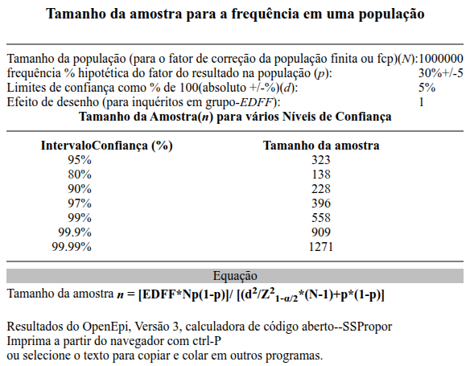
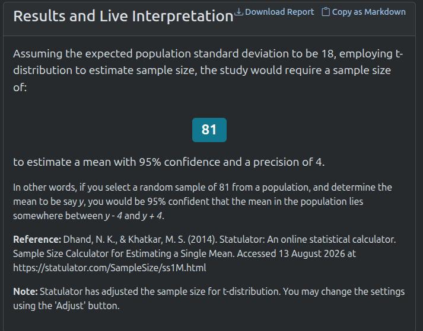
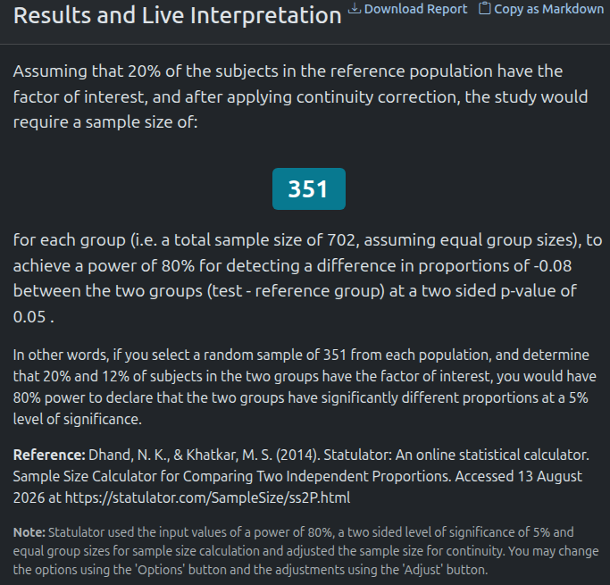
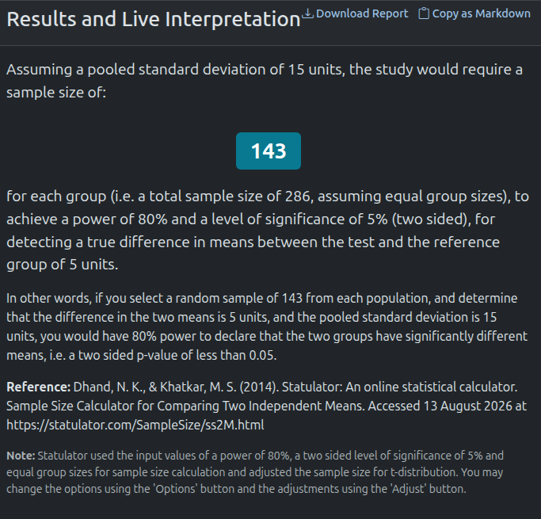
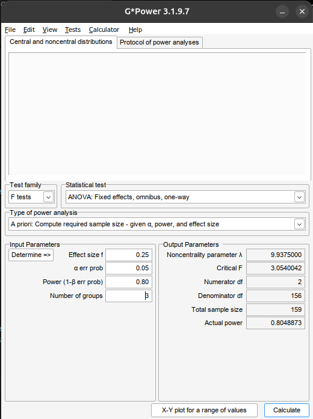

# Conceitos Fundamentais

## Conceitos Fundamentais

- **Estatística** é a ciência utilizada para fazer inferências sobre fenômenos aleatórios específicos com base em informações relativamente limitadas provenientes de uma amostra.
- A Estatística possui duas áreas principais:
  - **Estatística Matemática:** desenvolvimento de novos métodos de inferência estatística.
  - **Estatística Aplicada:** aplicação dos métodos da Estatística Matemática a áreas específicas do conhecimento (Economia, Psicologia, Saúde Pública etc.).
- **Bioestatística** é o ramo da Estatística Aplicada que aplica métodos estatísticos a problemas médicos e biológicos.

## População vs. Amostra

- **População** corresponde ao conjunto de todas as unidades de interesse para uma pesquisa.
- Em Bioestatística, essas unidades podem ser pacientes, medicamentos, hospitais, unidades de saúde etc.
- Quando a população é definida como o universo para o qual se pretende generalizar os resultados, é denominada **população-alvo**.
- A parcela da população-alvo que pode ser efetivamente alcançada nas condições **geográficas, institucionais e temporais** do estudo é denominada **população acessível**.

## População vs. Amostra

- **Amostra** corresponde ao subconjunto de unidades selecionado da população para participar do estudo.
- O conjunto de unidades que o protocolo estabelece que deverá ser selecionado para o estudo é chamado de **amostra pretendida**.
- As unidades que foram efetivamente incluídas no estudo são denominadas de **participantes efetivos** (*actual subjects*).
- A diferença entre a amostra pretendida e os participantes efetivos pode resultar de **recusas, inelegibilidade, impossibilidade de contato e outras perdas durante o recrutamento**.

## Censo vs. Amostragem

- **Censo** é a coleta de dados de **todas as unidades da população de interesse**.
- **Amostragem** é o processo de **selecionar um subconjunto de unidades da população** para obter dados e realizar inferências sobre a população.
- No censo, não há **variabilidade decorrente da seleção de uma amostra**; na amostragem, os resultados estão sujeitos à **variabilidade amostral**.
- A escolha entre censo e amostragem depende da **dimensão da população, custos, tempo, acessibilidade e objetivos do estudo**.

#### Exemplo

- **Censo:** avaliar o teor de princípio ativo em **todos os lotes** produzidos por uma indústria durante determinado período.
- **Amostragem:** avaliar uma **parcela dos lotes** para estimar o teor de princípio ativo da produção.

## Parâmetro e Estimativa

- **Parâmetro** é uma quantidade que descreve uma característica da população.
  - Em geral, não conhecemos toda a população, então o parâmetro é **desconhecido**.
  - Os parâmetros são representados por valores como:
    - Média populacional ($\mu$)
    - Prevalência/proporção populacional ($p$)
    - Desvio-padrão populacional ($\sigma$)
- **Exemplo:** Qual é a prevalência (proporção) de idosos em polifarmácia que apresentam pelo menos um medicamento potencialmente inapropriado?
  - *Parâmetro:* proporção verdadeira $p$ de idosos da população-alvo com pelo menos um medicamento potencialmente inapropriado.

## Parâmetro e Estimativa

- Estimativa é um número calculado a partir dos dados observados de uma amostra e utilizado para estimar um parâmetro populacional.
  - Exemplos:
    - Média amostral ($\overline{x}$)
    - Prevalência/proporção amostral ($\widehat{p}$)
    - Desvio-padrão amostral ($s$)
- **Exemplo:** Em uma amostra de 400 idosos em polifarmácia, 140 apresentam pelo menos um medicamento potencialmente inapropriado.
  - *Estimativa:* $\widehat{p} = \frac{140}{400} = 0{,}35$
  - *Interpretação:* 35% da amostra apresentou pelo menos um medicamento potencialmente inapropriado.

## Variabildiade amostral

- **Variabilidade amostral** é a variação dos valores de uma estimativa entre diferentes amostras extraídas da mesma população.
- Mesmo quando todas as amostras são selecionadas pelo mesmo procedimento, elas podem conter indivíduos diferentes e, consequentemente, produzir estimativas diferentes.
- Portanto, uma estimativa amostral **não é necessariamente igual ao parâmetro populacional**.
- **Essa variação é esperada e é a base da inferência estatística.**

## Unidade de análise

- **Unidade de análise** é a unidade sobre a qual são realizadas as **análises estatísticas** e para a qual os resultados são interpretados.
- As variáveis são observadas ou medidas para cada unidade de análise.
- A unidade de análise deve ser compatível com a **pergunta, o objetivo e o delineamento da pesquisa**.
- **Exemplos:**
  - Paciente
  - Unidade de saúde
  - Medicamento

## Variáveis

- **Variável** é uma característica de uma unidade de estudo que pode assumir diferentes valores entre as unidades ou observações.
  - Uma variável representa uma característica que será **observada, medida ou classificada** no estudo.

#### Exemplo

| Unidade    | Idade | Anticoagulante | Sangramento grave |
| ---------- | ----: | -------------- | ----------------- |
| Paciente 1 |    67 | Varfarina      | Não               |
| Paciente 2 |    74 | Apixabana      | Sim               |
| Paciente 3 |    61 | Rivaroxabana   | Não               |

> Paciente é a unidade de estudo; idade, anticoagulante e sangramento grave são variáveis.

## Tipos de Variáveis

- As variáveis podem ser classificadas de acordo com a natureza dos valores que assumem.

- **Variáveis qualitativas:** seus valores representam **categorias ou grupos**.

:::{.columns}

:::{.column width="2%"}

:::

:::{.column width="17%"}

- Exemplos:

:::

:::{.column width="40%"}

- Sexo
- Anticoagulante utilizado

:::

:::{.column width="41%"}

- Presença de reação adversa
- Gravidade da reação adversa

:::

::::

- **Variáveis quantitativas:** seus valores representam **quantidades mensuráveis**, para as quais operações aritméticas têm significado.

:::{.columns}

:::{.column width="2%"}

:::

:::{.column width="17%"}

- Exemplos:

:::

:::{.column width="40%"}

- Idade
- Pressão sistólica

:::

:::{.column width="41%"}

- Concentração plasmática
- Número de medicamentos

:::

::::

## Variáveis Qualitativas (categóricas)

- **Nominal:** as categorias não possuem ordem natural. $\phantom{aaaaaaaaaaaaaaaaaaaaa}$

:::{.columns}

:::{.column width="2%"}

:::

:::{.column width="17%"}

- Exemplos:

:::

:::{.column width="81%"}

- Sexo (Feminino, masculino, etc.)
- Tipo sanguíneo (A, B, O, AB)
- Classe terapêutica (anticoagulante, antidiabético, etc.)

:::

::::

- **Ordinal:** as categorias apresentam uma ordem natural. $\phantom{aaaaaaaaaaaaaaaaaaa}$

:::{.columns}

:::{.column width="2%"}

:::

:::{.column width="17%"}

- Exemplos:

:::

:::{.column width="81%"}

- Intensidade da reação adversa (leve, moderada, grave)
- Grau de satisfação: (baixo, moderado, alto)
- Estágio clínico (I, II, III e IV))

:::

::::

## Variáveis Quantitativas (numéricas)

- **Discreta:** assume valores provenientes de uma contagem, geralmente inteiros.

:::{.columns}

:::{.column width="2%"}

:::

:::{.column width="17%"}

- Exemplos:

:::

:::{.column width="81%"}

- número de medicamentos
- número de hospitalizações
- número de eventos adversos

:::

::::

- **Contínua:** pode assumir qualquer valor em um intervalo, dentro da precisão de mensuração.

:::{.columns}

:::{.column width="2%"}

:::

:::{.column width="17%"}

- Exemplos:

:::

:::{.column width="81%"}

- peso
- creatinina
- dose

:::

::::

## Por que classificar as variáveis?

- A natureza da variável orienta a análise estatística.
  - Isto é, influencia a forma de descrevê-la, visualizá-la, compará-la e modelá-la.

| Tipo de variável | Exemplos de resumo | Exemplos de métodos |
| ---------------- | ------------------ | ------------------ |
| Qualitativa Nominal  | frequência, proporção          | qui-quadrado, regressão logística       |
| Qualitativa Ordinal  | frequência, proporção, mediana | métodos para dados ordinais             |
| Quantitativa Discreta | média, mediana, frequência     | modelos de contagem                     |
| Quantitativa Contínua | média, DP, mediana, amplitude  | *t* de Student, ANOVA, regressão linear |

## Exposição e Desfecho

Em pesquisas que investigam **relações entre características, condições ou intervenções e resultados**, é necessário distinguir o papel **desempenhado pelas variáveis**.

- **Exposição** é a variável que representa a característica, condição ou intervenção de interesse cuja relação com o desfecho se pretende investigar.
- **Desfecho** é a variável que representa a característica ou evento que se pretende explicar, comparar ou avaliar em função da exposição.
- **Exemplo:** O uso de um novo anticoagulante está associado a menor ocorrência de sangramento grave?
  - Exposição: tipo de anticoagulante utilizado
  - Desfecho: ocorrência de sangramento grave

## Covariável

Além da **exposição** e do **desfecho**, um estudo pode incluir outras variáveis relevantes para a análise (covariáveis).

- **Covariável** é uma variável adicional considerada na análise em relação à exposição e ao desfecho.
- **Exemplo:** O uso de um novo anticoagulante está associado a menor ocorrência de sangramento grave?
  - Exposição: tipo de anticoagulante utilizado
  - Desfecho: ocorrência de sangramento grave
  - Covariáveis: idade, função renal, uso de antiagregantes

## Exemplo

Um grupo de pesquisadores deseja estimar a frequência de **medicamentos potencialmente inapropriados (MPI)** entre idosos em polifarmácia atendidos em unidades de saúde de Aracaju. Foram avaliados **400 idosos**, dos quais **140 apresentavam pelo menos um MPI** Além da presença de MPI, foram coletados:

::::{.columns}

:::{.column width="15%"}

- Idade
- Sexo

:::

:::{.column width="45%"}

- Número de medicamentos em uso
- Presença de diabetes

:::

:::{.column width="35%"}

- Função renal
- Uso de benzodiazepínicos
:::

::::

### Identifique

::::{.columns}

:::{.column width="33%"}

1. População-alvo
2. Amostra
3. Unidade de análise
4. Parâmetro de interesse

:::

:::{.column width="36%"}

5. Estimativa do parâmetro
6. Tipos de variáveis
7. Desfecho
8. Exposição

:::

:::{.column width="30%"}

9. Covariáveis
:::

::::

## Exemplo

Pesquisadores acompanharam **1.200 pacientes com fibrilação atrial** que iniciaram tratamento anticoagulante. No início do estudo, 600 pacientes utilizavam **apixabana** e 600 utilizavam **varfarina**. Após 12 meses de acompanhamento:, **36 pacientes em uso de apixabana** apresentaram sangramento grave e **60 pacientes em uso de varfarina** apresentaram sangramento grave. Também foram coletadas:

::::{.columns}

:::{.column width="33%"}

- Idade
- Sexo

:::

:::{.column width="33%"}

- Função renal
- Uso de antiagregantes

:::

:::{.column width="33%"}

- Histórico de sangramento
:::

::::

### Identifique

::::{.columns}

:::{.column width="33%"}

1. População-alvo
2. Amostra
3. Unidade de análise

:::

:::{.column width="36%"}

4. Parâmetro de interesse
5. Estimativa do parâmetro
6. Tipos de variáveis

:::

:::{.column width="30%"}

7. Desfecho
8. Exposição
9. Covariáveis
:::

::::

## As variáveis devem atender ao objetivo da pesquisa

- As variáveis devem ser definidas de acordo com a **pergunta e os objetivos da pesquisa**.
- Se um estudo não coletar as variáveis necessárias para responder à pergunta científica, **os dados coletados não permitirão respondê-la**.
- Ao definir cada objetivo, determine as **variáveis necessárias para atendê-lo**, incluindo aquelas que permitam medir a **exposição, o desfecho e outros fatores relevantes**.

- **A análise estatística não consegue recuperar uma informação que não foi coletada!**

# Delineamento e Estrutura dos Dados

## Delineamento do estudo

- O delineamento da pesquisa define como exposição e desfecho serão observados ou atribuídos e como os dados serão obtidos ao longo do estudo.
  - Isto influencia **quais comparações podem ser realizadas**, quais medidas podem ser estimadas e quais métodos estatísticos são apropriados.
  - A escolha deve ser compatível com a **pergunta científica**.
- **Exemplo:** O uso de um novo anticoagulante reduz o risco de sangramento grave?
  - *Observacional:* compara usuários dos diferentes anticoagulantes.
  - *Experimental:* o tratamento é atribuído pelo pesquisador.

## Estudo observacional vs. experimental

- **Estudo observacional:** o(a) pesquisador(a) observa as exposições existentes, sem determinar a exposição por meio do protocolo.
  - **Inferência:** identificar associação, com possibilidade de confundimento.
- **Estudo experimental:** o(a) pesquisador(a) determina a intervenção ou exposição segundo o protocolo do estudo.
  - **Inferência:** randomização pode permitir melhor identificação do efeito causal da intervenção.
- **Exemplo:** Um novo serviço farmacêutico reduz hospitalizações?
  - *Observacional:* compara pacientes que receberam ou não o serviço conforme a prática usual.
  - *Experimental:* atribui os participantes ao serviço farmacêutico ou ao cuidado usual.

## Estudo observacional vs. experimental

### Observacional

- Transversal
- Caso-controle
- Coorte

### Experimental

- Ensaio clínico randomizado
- Quase-experimental

## Estudo transversal

- **Estudo transversal** é aquele em que exposição e desfecho são avaliados em um determinado momento ou período de observação.
- É particularmente adequado para estimar a **frequência de características ou condições** em uma população.
- A temporalidade limitada dificulta estabelecer se a exposição precedeu o desfecho.
- **Exemplo:** Estimar a prevalência de medicamentos potencialmente inapropriados entre idosos em polifarmácia.
  - *População:* idosos em polifarmácia
  - *Exposição:* características da farmacoterapia
  - *Desfecho:* presença de medicamento potencialmente inapropriado
  - *Medida de interesse:* prevalência

## Estudo caso-controle

- **Estudo caso-controle** seleciona participantes segundo a ocorrência do desfecho e investiga exposições anteriores.
- Os participantes são classificados como **casos** e **controles**.
  - A seleção adequada dos controles é fundamental para a validade da estimativa.
- A medida clássica de associação é **Odds Ratio (OR)**.
- **Exemplo:** Investigar fatores associados a reações adversas graves a anticoagulantes.
  - *Casos:* pacientes com reação adversa grave
  - *Controles:* pacientes sem reação adversa grave
  - *Exposição investigada:* tipo de anticoagulante, dose, função renal etc.

## Estudo de coorte

- **Estudo de coorte** acompanha indivíduos classificados segundo a **exposição** e observa a ocorrência do desfecho ao longo do tempo.
- Permite estabelecer a **temporalidade** entre exposição e desfecho.
- Permite estimar, entre outras medidas:
  - Incidência;
  - Risco;
  - Razão de riscos (*risk ratio*);
  - Diferença de riscos;
  - *Hazard ratio*, quando o tempo até o evento é analisado.
- **Exemplo:** Comparar o risco de sangramento grave entre usuários de apixabana e varfarina.

## Ensaio clínico randomizado

- **Ensaio clínico randomizado** é um estudo experimental em que os participantes são **aleatoriamente alocados** às intervenções previstas no protocolo.
- A randomização busca tornar os grupos comparáveis quanto a fatores conhecidos e desconhecidos, em média.
- A análise concentra-se na comparação dos efeitos entre os grupos, considerando:
  - Efeito estimado;
  - Incerteza da estimativa;
  - Análise por intenção de tratar;
  - Perdas e adesão ao tratamento.
- **Exemplo:** Avaliar se um novo antidiabético reduz mais a HbA1c que o tratamento padrão.

## Estudo quase-experimental

- **Estudo quase-experimental** avalia uma intervenção sem a alocação aleatória típica do ensaio clínico randomizado.
- É frequente na avaliação de **serviços e intervenções farmacêuticas**.
- **Exemplo:** Avaliar o efeito da implantação de um serviço de conciliação medicamentosa sobre erros de medicação.

Período antes da implantação | Implantação do serviço | Período após a implantação

- A ausência de randomização exige atenção a **diferenças entre grupos, tendências temporais, confundimento e mudanças ocorridas simultaneamente à intervenção**.
- Podem ser utilizados métodos como **diferenças-em-diferenças** e **séries temporais interrompidas**, dependendo do desenho.

## Estruturas temporais e de desfecho

### Estudo longitudinal

- **Estudo longitudinal** é aquele em que os participantes são observados em **dois ou mais momentos ao longo do tempo**.
- O acompanhamento temporal permite avaliar **mudanças nos desfechos** e a ocorrência de eventos ao longo do período de estudo.
- Quando as mesmas unidades são avaliadas repetidamente, as observações são **correlacionadas** e não devem ser tratadas como observações independentes.
- **Exemplo:** Avaliar a evolução da HbA1c durante 12 meses em pacientes que iniciaram um novo antidiabético.
  - *Exposição:* tratamento
  - *Desfecho:* HbA1c
  - **Momentos:** basal, 3, 6 e 12 meses
- A análise deve considerar a dependência entre as observações do mesmo participante.
- Podem ser necessários métodos para medidas repetidas, como modelos mistos ou GEE.

## Estruturas temporais e de desfecho

### Tempo até o evento

- Em alguns estudos, o interesse não é apenas saber **se o evento ocorreu**, mas também **quanto tempo transcorreu até sua ocorrência**.
- Cada participante é acompanhado até ocorrência do evento ou término do acompanhamento sem ocorrência do evento.
- Quando o evento não é observado durante o período de acompanhamento, temos uma **observação censurada**.
- **Exemplo:** Comparar o tempo até a primeira hospitalização entre usuários de apixabana e varfarina.
  - *Exposição:* anticoagulante utilizado
  - *Desfecho:* primeira hospitalização
  - *Tempo:* dias desde o início do acompanhamento até hospitalização ou censura
- A análise precisa considerar simultaneamente a ocorrência do evento, o tempo de acompanhamento e a censura.
- *Métodos:* Kaplan-Meier, teste de log-rank e modelo de Cox.

## Diferentes dimenões do delineamento

| Dimensão                       | Exemplos                              |
| ------------------------------ | ------------------------------------- |
| **Tipo de estudo**             | observacional / experimental          |
| **Delineamento observacional** | transversal / caso-controle / coorte  |
| **Intervenção**                | ensaio clínico / quase-experimental   |
| **Temporalidade**              | transversal / longitudinal            |
| **Estrutura do desfecho**      | binário / contínuo / tempo até evento |
| **Observações**                | independentes / medidas repetidas     |

# Amostragem

## Amostragem

- **Amostragem** é o processo de seleção de unidades de uma população para compor a amostra do estudo.
- O método de amostragem determina **como as unidades podem ser selecionadas** e influencia a capacidade de realizar inferências para a população.
- **Importante:** probabilística vs. não probabilística descreve o **processo de seleção**, não a qualidade intrínseca dos dados ou do estudo.

## Amostragem probabilística vs. não probabilística

#### Amostragem probabilística
- Cada unidade elegível possui uma **probabilidade conhecida e não nula de seleção**.
- A seleção é realizada por um mecanismo probabilístico.
- Permite fundamentar a inferência estatística considerando formalmente o **plano amostral**.
- Principais técnicas:
  - Amostragem aleatória simples
  - Amostragem sistemática
  - Amostragem estratificada
  - Amostragem por conglomerados

## Amostragem probabilística vs. não probabilística

#### Amostragem não probabilística
- A probabilidade de seleção das unidades **não é conhecida ou não é determinada por um mecanismo probabilístico**.
- A seleção depende de disponibilidade, acessibilidade ou critérios definidos pelo pesquisador.
- Pode limitar a capacidade de generalizar os resultados para a população-alvo.
- Principais técnicas:
  - Amostragem por coveniência
  - Amostragem consecutiva
  - Amostragem intencional
  - Amostragem bola de neve

## Amostragem aleatória simples

- **Amostragem aleatória simples** é aquela em que cada unidade da população possui **igual probabilidade de ser selecionada** e cada amostra possível de determinado tamanho possui a mesma probabilidade de seleção.
- **Exemplo:** Selecionar aleatoriamente 300 pacientes a partir do cadastro de todos os pacientes elegíveis de uma rede de unidades de saúde.
  - Cada paciente elegível possui a mesma probabilidade de ser selecionado.

#### Implicações estatísticas

- É a forma mais simples de amostragem probabilística.
- Fornece uma base direta para a **inferência sobre a população**, desde que a população acessível esteja adequadamente definida.
- Os métodos usuais de erro-padrão e intervalo de confiança podem ser aplicados sob o plano amostral correspondente.

## Amostragem sistemática

- **Amostragem sistemática** seleciona unidades em **intervalos regulares** a partir de uma lista ordenada da população, após a escolha aleatória do ponto inicial.
- **Exemplo:** Selecionar 1 a cada 10 prescrições de uma lista de prescrições elegíveis.

#### Implicações estatísticas

- Pode ser mais simples operacionalmente que a amostragem aleatória simples.
- Requer uma lista adequada da população.
- A ordenação da lista deve ser avaliada, pois padrões periódicos relacionados às características de interesse podem comprometer a seleção.
- **Atenção:** "selecionar cada décima pessoa" não é suficiente para caracterizar uma amostragem sistemática probabilística; é **necessário um ponto inicial** aleatório e um mecanismo de seleção definido.

## Amostragem estratificada

- **Amostragem estratificada** divide a população em **estratos** definidos por características relevantes e realiza a seleção dentro de cada estrato.
- Os estratos devem ser definidos **antes da seleção da amostra**.
- **Exemplo:** Selecionar pacientes separadamente segundo faixas etárias (18-39 anos, 40-59 anos, ≥ 60 anos).

#### Implicações estatísticas

- Pode garantir a presença de subgrupos relevantes na amostra.
- Pode aumentar a **precisão das estimativas** quando os estratos são internamente mais homogêneos.
- A análise deve considerar o **plano de estratificação**, especialmente quando as frações amostrais diferem entre os estratos.

## Amostragem por conglomerados

- Amostragem por conglomerados seleciona grupos de unidades (conglomerados) em vez de selecionar diretamente todas as unidades individuais da população.
- As unidades dentro dos conglomerados são então investigadas segundo o plano amostral.
- Conglomerados comuns: UBS, hospitais, farmácias e municípios.
- **Exemplo:** Selecionar aleatoriamente 20 unidades básicas de saúde e incluir os pacientes elegíveis dessas unidades.

#### Implicações estatísticas

- Pacientes da mesma unidade de saúde podem apresentar características mais semelhantes entre si do que pacientes de unidades diferentes.
  - A análise que ignora essa estrutura pode subestimar a variabilidade das estimativas.
  - Em estudos complexos, podem ser necessários métodos que considerem o efeito do desenho amostral.

## Amostragem por conveniência

- **Amostragem por conveniência** seleciona unidades que estão facilmente disponíveis ao pesquisador.
- **Exemplo:** Recrutar pacientes que comparecerem à farmácia-escola durante o período da pesquisa.

#### Implicações estatísticas

- É simples e barata, mas o mecanismo de seleção pode produzir uma amostra sistematicamente diferente da população-alvo.
- A aplicação direta dos métodos de inferência pode não representar adequadamente a **incerteza decorrente do processo de seleção**.
- A generalização para a população-alvo deve ser feita com cautela.
- **Ter uma amostra grande não elimina o problema de seleção.**

## Amostragem consecutiva

- **Amostragem consecutiva** inclui, durante determinado período, todas as unidades elegíveis que atendem aos critérios de seleção, até atingir o tamanho amostral planejado ou o término do período definido.
- **Exemplo:** Incluir todos os pacientes elegíveis atendidos em uma clínica farmacêutica entre janeiro e dezembro, até atingir 300 participantes.

#### Implicações estatísticas

- É frequente em pesquisas clínicas e hospitalares.
- Pode reduzir a seleção arbitrária de participantes em comparação com uma amostra de conveniência baseada apenas na disponibilidade.
- **Não é necessariamente probabilística:** se todos os elegíveis de um serviço são incluídos, o problema passa a ser principalmente **qual população esse serviço representa**.
- **"Consecutiva" não significa "aleatória".**

## Amostragem intencional

- **Amostragem intencional** seleciona deliberadamente unidades consideradas relevantes para os objetivos do estudo, segundo critérios estabelecidos pelo pesquisador.
- **Exemplo:** Selecionar farmacêuticos com experiência em farmacovigilância para investigar barreiras à notificação de reações adversas.

#### Implicações estatísticas

- É útil quando o objetivo exige participantes com **características específicas**.
- A probabilidade de seleção não é conhecida.
- A inferência estatística para uma população mais ampla fica limitada pelo processo de seleção.
- É mais comum em pesquisas exploratórias e qualitativas, mas também pode aparecer em pesquisas quantitativas com populações específicas.

## Amostragem em bola de neve

- **Amostragem em bola de neve** inicia-se com participantes elegíveis que indicam ou recrutam outros indivíduos que atendem aos critérios do estudo.
- **Exemplo:** Recrutar participantes de uma população de difícil acesso por meio da indicação de novos participantes pelos indivíduos inicialmente recrutados.

#### Implicações estatísticas

- Pode permitir acesso a populações para as quais não existe uma lista adequada de unidades elegíveis.
- A seleção pode produzir participantes com características semelhantes às dos indivíduos que os indicaram.
- A probabilidade de seleção não é conhecida, limitando a inferência para a população-alvo.
- **A rede de recrutamento passa a fazer parte do processo de seleção.**

## Representatividade

- **Representatividade** refere-se ao grau em que as unidades selecionadas para a amostra refletem, nas características relevantes para a pesquisa, a população sobre a qual se pretende fazer inferências.
- A representatividade depende da **população definida**, do **processo de seleção** e das características relevantes para a pergunta científica.
- Uma amostra pode representar adequadamente uma população para uma determinada finalidade, mas não necessariamente para outra.
- **Exemplo:** estimar a prevalência de polifarmácia entre idosos de uma cidade.
  - Uma amostra composta apenas por idosos atendidos em um hospital de referência pode diferir da população de idosos da cidade quanto a gravidade das doenças, número de medicamentos e comorbidades.
- **A amostra precisa ser adequada à população e à pergunta para a qual se pretende generalizar os resultados.**

## Amostragem probabilística e representatividade

- A **amostragem probabilística** não garante que uma amostra específica reproduza perfeitamente a população.
- Ela fornece um **mecanismo conhecido de seleção**, permitindo quantificar a variabilidade decorrente da amostragem sob o plano amostral.
- Uma amostra não probabilística pode apresentar características semelhantes às da população e, ainda assim, não oferecer a mesma base para a inferência estatística.
- **Representatividade não é sinônimo de semelhança descritiva entre amostra e população.**

## Viés

- **Viés** é um erro sistemático que produz uma diferença entre a estimativa obtida e o valor que seria esperado sob o procedimento de estudo ideal.
- Diferentemente da **variabilidade amostral**, o viés não é eliminado simplesmente aumentando o tamanho da amostra.
- **Exemplo:** estimar a prevalência de diabetes na população adulta.
  - Se o estudo recruta participantes exclusivamente em um serviço especializado em diabetes, a frequência observada pode ser sistematicamente maior que a frequência na população-alvo.
- **Uma amostra grande pode produzir uma estimativa muito precisa do valor errado.**

## Viés de seleção

- **Viés de seleção** ocorre quando o processo de seleção ou permanência dos participantes no estudo produz diferenças sistemáticas entre os participantes estudados e a população relevante para a inferência.
- **Exemplo:** avaliar a satisfação dos pacientes com um serviço farmacêutico.
  - O pesquisador disponibiliza um questionário voluntário exclusivamente para pacientes que retornam ao serviço.
  - Pacientes mais satisfeitos podem ter maior probabilidade de retornar e responder.
  - Pacientes insatisfeitos podem estar menos propensos a participar.
  - A satisfação observada pode não representar a satisfação da população de pacientes atendidos.
  - Fontes possíveis de viés são a seleção dos participantes, não participação, perdas de seguimento e critérios de inclusão/exclusão inadequados.

## Viés de não resposta

- **Não resposta** ocorre quando unidades selecionadas para o estudo não participam ou não fornecem determinadas informações.
- A não resposta pode produzir viés quando os indivíduos que não respondem **diferem sistematicamente dos participantes** em características relacionadas à pesquisa.
- **Exemplo:** 1.000 pacientes são selecionados para responder a um questionário sobre adesão medicamentosa, mas apenas 500 respondem.
  - A questão estatística não é apenas "Quantos não responderam?", mas
  - **“Os que não responderam diferem dos que responderam de maneira relevante para o estudo?”**

## Viés

- A inferência pode ser comprometida por:
  - variabilidade amostral → estimativas variam entre amostras;
  - viés de seleção → seleção sistematicamente distorcida;
  - não resposta → participantes podem diferir dos não participantes;
  - população acessível inadequada → população estudada pode não corresponder à população-alvo.
- **Aumentar o tamanho da amostra reduz a variabilidade amostral, mas não corrige um processo de seleção enviesado.**

# Cálculo do tamanho amostral

## Por que calcular o tamanho amostral?

- O tamanho amostral deve ser definido **antes da coleta de dados**, a partir do objetivo principal do estudo.
- Uma amostra muito pequena pode produzir estimativas imprecisas ou baixo poder para detectar efeitos relevantes.
- Uma amostra excessivamente grande pode utilizar recursos desnecessariamente e expor mais participantes a procedimentos de pesquisa sem benefício científico proporcional.

## Elementos do cálculo

#### Tamanho amostral

- O tamanho amostral depende do **objetivo estatístico do estudo** e das características esperadas dos dados.

#### Informações necessárias para estudos de estimação

:::{.columns}

:::{.column width="2%"}

:::

:::{.column width="40%"}

- Margem de erro
- Nível de confiança

:::

:::{.column width="58%"}

- Variabilidade ou frequência esperada
- Tamanho da população, quando relevante

:::

::::

#### Informações necessárias para estudos de comparação

:::{.columns}

:::{.column width="2%"}

:::

:::{.column width="40%"}

- Diferença ou efeito mínimo relevante
- Nível de significância
- Poder estatístico

:::

:::{.column width="58%"}

- Variabilidade ou frequência esperada
- Proporção entre os grupos
- Perdas esperadas, quando aplicável

:::

::::

## Margem de erro

- **Margem de erro** é o afastamento máximo desejado entre a estimativa amostral e o parâmetro populacional, dentro do nível de confiança especificado.
- **Exemplo:** Queremos estimar a prevalência de medicamentos potencialmente inapropriados entre idosos com margem de erro de $\pm 5$ pontos percentuais.
  - Se a estimativa for $$\widehat{p} = 30\%$$ um intervalo com margem de erro de 5 pontos percentuais seria, aproximadamente: $$25\% \text{ a } 35\%$$.
- Quanto menor a margem de erro, maior o tamanho de $n$.
- **Atenção:** margem de erro é especialmente importante quando o objetivo é **estimar um parâmetro**.

## Nível de confiança

- O **nível de confiança** determina o grau de confiança utilizado na construção do intervalo de confiança.
- Os valores mais utilizados são 90%, 95% e 99%.
- Quanto maior o nível de confiança, maior o tamanho de $n$.

## Variabilidade

- A variabilidade da característica estudada influencia diretamente o tamanho necessário da amostra.
- Quanto maior a variabilidade dos dados, maior tende a ser o número de participantes necessário para obter determinada precisão.
- **Exemplos:**
  - Para desfechos quantitativos, o cálculo geralmente requer uma medida da variabilidade, como o desvio-padrão ($\sigma$).
  - Para desfechos binários, o cálculo geralmente requer uma proporção esperada ($p$).
- Quanto maior a variabailidade, maior o tamanho de $n$.

## Diferença mínima relevante

- A **diferença mínima relevante** é a menor diferença entre grupos que o estudo deve ser capaz de detectar.
- Deve ser definida a partir da **relevância científica e clínica**, e não escolhida apenas para produzir um tamanho amostral conveniente.
- **Exemplo:** Um novo tratamento reduz a HbA1c em relação ao tratamento padrão.
  - A pesquisadora decide que uma diferença de $$\Delta = 0{,}5\%$$ seria clinicamente relevante.
  - O estudo será dimensionado para detectar essa diferença.
- Quanto menor a diferança, maior o tamanho de $n$.

## Nível de significância

- O **nível de significância** $\alpha$ é definido antes do estudo e estabelece o limite para rejeição da hipótese nula.
- Nível de significância é o coplementar do nível de confiança.
  - Se a confiança é de 95%, a significância é 5%.
- Valores frequentemente utilizado são $\alpha=0{,}05$ e $\alpha=0{,}01$.
- Quanto menor o nível de significância ($\alpha$), maior o tamanho de $n$.
- **Atenção:** Significância estatística não define relevância clínica.

## Poder estatístico

- **Poder estatístico** é a probabilidade de detectar um efeito de determinada magnitude quando esse efeito realmente existe.
- $Poder=1-\beta$
- Valores frequentemente utilizados são 80% ou 90%.
- Quanto maior o poder, maior o tamanho de $n$.

## Ajuste para perdas e não resposta

- Após determinar o tamanho amostral mínimo necessário, pode ser necessário aumentar o número de unidades a serem **selecionadas ou recrutadas** para considerar não resposta, perdas de seguimento ou dados não avaliáveis.
- O cálculo é $$n_{\text{final}}=\frac{n_{\text{inicial}}}{1-\text{perda}}$$
- Se $n=300$ e esperamos 10% de perdas: $$n_{\text{final}}=\frac{300}{1-0{,}10}=334$$
- Perdas devem ser consideradas no planejamento, não depois que o estudo terminou.

## Problema 1 -- Estimar uma prevalência

- Uma equipe pretende realizar um estudo para estimar a prevalência de medicamentos potencialmente inapropriados entre idosos em polifarmácia.
- Informações que entram no cálculo e foram previamente definidas pelos pesquisadores:
  - nível de confiança de 95%;
  - margem de erro de $\pm 5$ pontos percentuais;
  - prevalência observada em estudos anteriores de 30%;
  - expectativa de não resposta ou dados não avaliáveis: 15%.

#### Problema 1 -- Estimar uma prevalência

#### Como calcular?

- Para estimar uma prevalência, precisamos identificar:
  - **Parâmetro:** proporção de medicamentos inapropriados ($p$);
  - Prevalência/proporção em estudos anterioes: 30%;
  - **Margem de erro:** 5 p.p.;
  - **Nível de confiança:** 95%.
  - **Perdas:** 15%

## Problema 1 -- Estimar uma prevalência

#### Como calcular

1. Acesse <https://www.openepi.com/>
2. No menu à esquerda, clique em *Tamanho da amostra > Proporção*
3. Selecione a aba *Entrar dados*
4. Em *Frequência (p) antecipada %* informe a prevalência de estudos anteriores ou da amostra piloto (No exemplo: 30)
5. Em *Limites de confiança como +/- porcentagem de 100* informe a margem de erro (No exemplo: 5)
6. Clique em *Calcular*

## Problema 1 -- Estimar uma prevalência

  

## Problema 1 -- Estimar uma prevalência

- Para o nosso exemplo, o tamanho mínimo de amostra é $n=323$.
- Considerando 15% de perdas, o $n$ final é $$n_{\text{final}}=\frac{323}{1-0{,}15}=380$$
- Devemos selecionar/recrutar 380 indivíduos para obter aproximadamente 323 participantes avaliáveis.

## Problema 2 -- Estimar uma média

- Uma equipe de pesquisa pretende estimar a concentração plasmática média de um novo antibiótico em pacientes adultos tratados na dose terapêutica recomendada.
- Uma amostra piloto de 30 apcientes iindicou desvio-padrão de aproximadamente 18 mg/L.
- Os pesquisadores desejam estimar a concentração média com:
  - 95% de confiança;
  - margem de erro de ±4 mg/L;
  - expectativa de não resposta ou dados não avaliáveis: 10%.

## Problema 2 -- Estimar uma média

#### Como calcular?

- Para estimar uma média, precisamos identificar:
  - **Parâmetro:** concentração plasmática média $\mu$;
  - **Desvio padrão:** 18 mg/L;
  - **Margem de erro:** 4 mg/L;
  - **Nível de confiança:** 95%.
  - **Perdas:** 10%

## Problema 2 -- Estimar uma média

#### Como calcular?

1. Acesse <https://www.statulator.com/>
2. No canto superior direto clique nas 3 barras horizontais
3. Clique em *Sample Size > Estimate Mean*
4. Em *Level of Confidence* selecione o nível de confiança (No exemplo: 0.95)
5. Em *Expected Standard Deviation* insira o desvio-padrão da amostra piloto (No exemplo: 18)
6. Em *Precision or Margin of Error* insira a margem de erro (No exemplo: 4)
7. Clique em *Calculate*

## Problema 2 -- Estimar uma média

  

## Problema 2 -- Estimar uma média

- Para o nosso exemplo, o tamanho mínimo de amostra é $n=81$.
- Considerando 10% de perdas, o $n$ final é $$n_{\text{final}}=\frac{81}{1-0{,}10}=90$$
- Devem ser recrutados aproximadamente 90 pacientes, esperando-se obter pelo menos 81 medidas avaliáveis.

## Exemplo Prático 1

Você pretende realizar um **estudo transversal** para estimar a prevalência de uso de medicamentos genéricos entre usuários de medicamentos na população brasileira.

**Estudo de referência:** BERTOLDI, A. D. et al. Utilização de medicamentos genéricos na população brasileira: uma avaliação da PNAUM 2014. Revista de Saúde Pública, v. 50, supl. 2, p. 11s, 2016. DOI: 10.1590/S1518-8787.2016050006120.

- O estudo encontrou **45,5%** de prevalência de uso de medicamentos genéricos (IC95%: 43,7%–47,3%).

-  Para o novo estudo, deseja-se:
  - **Nível de confiança:** 95%
  - **Margem de erro:** ±5 pontos percentuais

Determine o tamanho mínimo da amostra necessário para a pesquisa.

## Exemplo Prático 2

Você pretende realizar um **estudo para estimar a perda transepidérmica de água (TEWL) média** em adultos saudáveis após o uso de um novo creme cosmético.

**Estudo de referência:** KELCHEN, M. N. et al. A pilot study to evaluate the effects of topically applied cosmetic creams on epidermal responses. *Skin Pharmacology and Physiology*, v. 31, n. 5, p. 269–282, 2018. DOI: 10.1159/000490531.

- Em uma amostra piloto de 10 voluntários, a TEWL após 5 dias de aplicação de um creme contendo o Polímero A foi **9,5 ± 1,8 g/m²/h**.

- Para o novo estudo, deseja-se:
  - **Nível de confiança:** 95%
  - **Margem de erro:** ±0,5 g/m²/h

Determine o tamanho mínimo da amostra necessário para a pesquisa.

## Problema 3 -- Comparar duas proporções

- Uma equipe pretende realizar um estudo para comparar a ocorrência de **sangramento grave** entre pacientes que utilizam um novo anticoagulante e pacientes que utilizam varfarina. 
- Informações que entram no cálculo e foram previamente definidas pelos pesquisadores:
  - nível de significância de 5%;
  - poder estatístico de 80%;
  - prevalência esperada de sangramento grave de 12% no grupo do novo anticoagulante;
  - prevalência esperada de 20% no grupo da varfarina;
  - diferença mínima relevante: 8 pontos percentuais;
  - alocação dos participantes na proporção 1:1.

#### Problema 3 -- Comparar duas proporções independentes

#### Como calcular?

- Para comparar duas proporções, precisamos identificar:
  - **Proporção esperada no grupo 1:** 12%;
  - **Proporção esperada no grupo 2:** 20%;
  - **Diferença mínima a detectar:** 8 pontos percentuais;
  - **Nível de significância:** 5%;
  - **Poder estatístico:** 80%;
  - **Alocação entre os grupos:** 1:1.

## Problema 3 -- Comparar duas proporções independentes

#### Como calcular

1. Acesse <https://www.statulator.com/>
2. No canto superior direto clique nas 3 barras horizontais
3. Clique em *Sample Size > Compare Two Independent Propotions*
4. Em *Expected Outcome Proportion in the Reference Group* selecione a prevalência de sangramento grave (No exemplo: 0.20)
5. Em *Expected Outcome Proportion in the Test Group* selecione a prevalência de sangramento grave (No exemplo: 0.12)
6. Em *Options* defina *Desired Power: 0.80*, *Level of Significance: 0.05*, *Alternate Hypothesis: Two sided*, *Group Sizes: Equal* e clique em *Update*
7. Clique em *Calculate*

## Problema 3 -- Comparar duas proporções independentes

  

## Problema 3 -- Comparar duas proporções independentes

- Para o nosso exemplo, o tamanho mínimo de amostra é de aproximadamente **351 participantes por grupo**. Como a alocação é 1:1:
  - Grupo 1: $n=351$
  - Grupo 2: $n=351$
- Portanto, o estudo necessita de **702 participantes**.

#### Como reportar no artigo?

> O tamanho amostral foi calculado considerando prevalências esperadas de 20% e 12%, nível de significância de 5%, poder estatístico de 80%, diferença mínima relevante de 8 pontos percentuais e alocação 1:1. O cálculo indicou a necessidade de 351 participantes por grupo, totalizando 702 participantes.

## Outras situações de comparação de proporções

Além da comparação de duas proporções independentes, existem situações específicas que exigem outros cálculos, como:

- **Alocação desigual entre grupos**
- **Proporções pareadas** (antes/depois)
- **Comparação de mais de dois grupos**
- **Amostragem por conglomerados**
- **População finita**

- O método de cálculo deve ser escolhido de acordo com o **delineamento, objetivo, desfecho e estrutura da amostra**.

## Problema 4 -- Comparar duas médias independentes

- Uma equipe pretende realizar um estudo para comparar a **pressão arterial sistólica média** entre pacientes que utilizam um novo anti-hipertensivo e pacientes que utilizam o tratamento padrão.
- Informações que entram no cálculo e foram previamente definidas pelos pesquisadores:
  - nível de significância de 5%;
  - poder estatístico de 80%;
  - diferença mínima relevante de **5 mmHg**;
  - desvio-padrão esperado de **12 mmHg** em ambos os grupos;
  - alocação dos participantes na proporção 1:1.

#### Problema 4 -- Comparar duas médias independentes

#### Como calcular?

- Para comparar duas médias, precisamos identificar:
  - **Diferença mínima relevante:** 5 mmHg;
  - **Desvio-padrão esperado:** 12 mmHg;
  - **Nível de significância:** 5%;
  - **Poder estatístico:** 80%;
  - **Alocação entre os grupos:** 1:1.

## Problema 4 -- Comparar duas médias independentes

#### Como calcular?

1. Acesse <https://www.statulator.com/>
2. No canto superior direito, clique nas 3 barras horizontais.
3. Clique em *Sample Size > Compare Two Independent Means*.
4. Selecione *Expected Difference between Means*.
5. Em *Difference between Two Means:* informe a deferença mínima relevante (No exemplo: 5)
6. Em *Expected Standard Deviation:* informe o desvio-padrão (No exemplo: 12)
6. Em *Options*, defina *Desired Power: 0.80*, *Level of Significance: 0.05*, *Alternate Hypothesis: Two sided* e *Group Sizes: Equal*.
7. Clique em *Update* e depois em *Calculate*.

## Problema 4 -- Comparar duas médias independentes

  

## Problema 4 -- Comparar duas médias independentes

- Para o nosso exemplo, o tamanho mínimo de amostra é de aproximadamente **143 participantes por grupo**. Como a alocação é 1:1:
  - Grupo 1: $n=143$
  - Grupo 2: $n=143$
- Portanto, o estudo necessita de **286 participantes**.

#### Como reportar no artigo?

> O tamanho amostral foi calculado para detectar uma diferença mínima relevante de 5 mmHg na pressão arterial sistólica média entre os grupos, considerando desvio-padrão de 12 mmHg, nível de significância de 5%, poder estatístico de 80% e alocação 1:1. O cálculo indicou a necessidade de 91 participantes por grupo, totalizando 182 participantes.

## Outras situações de comparação de médias

Além da comparação de duas médias independentes, existem situações que exigem outros cálculos, como:

- **Duas médias pareadas** (antes/depois);
- **Alocação desigual entre grupos**;
- **Variâncias diferentes entre os grupos**;
- **Amostragem por conglomerados**;
- **População finita**.

- O método de cálculo deve ser escolhido de acordo com o **delineamento, objetivo, desfecho e estrutura dos dados**.

## Exemplo Prático 3

Você pretende realizar um **estudo transversal** para comparar a prevalência de **reações adversas a produtos cosméticos e de higiene pessoal** entre mulheres e homens adultos.

**Estudo de referência:** WILLIS, C. M. et al. Sensitive skin: an epidemiological study. *British Journal of Dermatology*, v. 145, n. 2, p. 258–263, 2001. DOI: 10.1046/j.1600-0536.2001.04343.x.

- No estudo de referência, **57% das mulheres** e **31,4% dos homens** relataram ter apresentado alguma reação adversa a um produto de uso pessoal ao longo da vida.

- Para o novo estudo, deseja-se:
  - **Nível de significância:** 5%
  - **Poder estatístico:** 80%
  - **Diferença mínima relevante:** 15 pontos percentuais
  - **Alocação:** 1:1

Determine o tamanho mínimo da amostra necessário para comparar as duas prevalências.

## Exemplo Prático 4

Você pretende realizar um **ensaio clínico randomizado** para avaliar se um programa de cuidado farmacêutico melhora a qualidade de vida de idosos com insuficiência cardíaca em comparação ao cuidado usual.

**Estudo de referência:** GRIMMINGER, P. et al. The impact of pharmacist/physician care on quality of life in elderly heart failure patients: results of the PHARM-CHF randomized controlled trial. *ESC Heart Failure*, 2020. DOI: 10.1002/ehf2.12944.

- No estudo de referência, após 730 dias, o escore médio do **Minnesota Living with Heart Failure Questionnaire (MLHFQ)** foi de **32,5 ± 19,3** no grupo de cuidado farmacêutico e **40,8 ± 19,8** no grupo de cuidado usual.

- Para o novo estudo, deseja-se:
  - **Nível de significância:** 5%
  - **Poder estatístico:** 80%
  - **Diferença mínima relevante:** 7 pontos
  - **Desvio-padrão esperado:** 20 pontos
  - **Alocação:** 1:1

Determine o tamanho mínimo da amostra necessário para comparar as duas médias.

## Problema 5 -- Comparar três ou mais médias

- Uma equipe pretende realizar um estudo para comparar a **pressão arterial sistólica média** entre pacientes tratados com três diferentes anti-hipertensivos.
- Informações que entram no cálculo e foram previamente definidas pelos pesquisadores:
  - nível de significância de 5%;
  - poder estatístico de 80%;
  - **3 grupos** de tratamento;
  - tamanho de efeito esperado: $f=0,25$;
  - alocação dos participantes na proporção 1:1:1.

## Problema 5 -- Comparar três ou mais médias

#### Como calcular?

- Para comparar três ou mais médias, precisamos identificar:
  - **Número de grupos:** 3;
  - **Tamanho de efeito esperado:** f=0,25;
  - **Nível de significância:** 5%;
  - **Poder estatístico:** 80%;
  - **Alocação entre os grupos:** 1:1:1.

- Na ANOVA, o tamanho de efeito considera a **diferença entre as médias em relação à variabilidade dentro dos grupos**.

## Problema 5 -- Comparar três ou mais médias

#### Como calcular

- Abra o G*Power.
- Em **Test family**, selecione **F tests**.
- Em **Statistical test**, selecione **ANOVA: Fixed effects, omnibus, one-way**.
- Em **Type of power analysis**, selecione **A priori: Compute required sample size**.
- Em **Effect size f**, informe o tamanho do efeito esperado (No exmplo: 0.25).
- Em **α err prob**, informe o nível de significância (No exemplo: 0.05).
- Em **Power (1 − β err prob)**, informe o poder estatístico (No exmeplo: 0.80).
- Em **Number of groups**, informe o número de grupos (No exemplo: 3).
- Clique em Calculate.

## Problema 5 -- Comparar três ou mais médias

## Problema 5 -- Comparar três ou mais médias

- Para o nosso exemplo, o tamanho mínimo de amostra é de aproximadamente 159 participantes Como a alocação é 1:1:1:
  - Grupo 1: n=53
  - Grupo 2: n=53
  - Grupo 3: n=53
- Portanto, o estudo necessita de 159 participantes.

#### Como reportar no artigo?

> O tamanho amostral foi calculado para detectar um efeito de magnitude f=0,25 entre três grupos, considerando nível de significância de 5%, poder estatístico de 80% e alocação 1:1:1. O cálculo indicou a necessidade de 53 participantes por grupo, totalizando 159 participantes.

## Outras situações de comparação de médias

Além da ANOVA de uma via com grupos independentes, existem situações que exigem outros cálculos, como:

- ANOVA com medidas repetidas;
- Grupos com tamanhos desiguais;
- ANOVA fatorial;
- ANCOVA;
- Interações entre fatores.

- O método de cálculo deve ser escolhido de acordo com o **delineamento, objetivo, desfecho e estrutura dos dados**.

## Exemplo Prático 5

Você pretende realizar um **estudo clínico randomizado** para comparar o efeito de três formulações cosméticas sobre a **hidratação da pele** de mulheres adultas com pele oleosa e tendência a imperfeições.

**Estudo de referência:** SANTOS-CAETANO, J.-P. et al. Cosmetic benefits of a novel biomimetic lamellar formulation containing niacinamide in healthy females with oily, blemish-prone skin in a randomized proof-of-concept study. *International Journal of Cosmetic Science*, 2020. DOI: 10.1111/ics.12576.

- Para o novo estudo, deseja-se:
  - **Nível de significância:** 5%
  - **Poder estatístico:** 80%
  - **Número de grupos:** 3
  - **Tamanho de efeito:** $f=0,25$
  - **Alocação:** 1:1:1

Determine o tamanho mínimo da amostra necessário para comparar as três médias.

# Fim