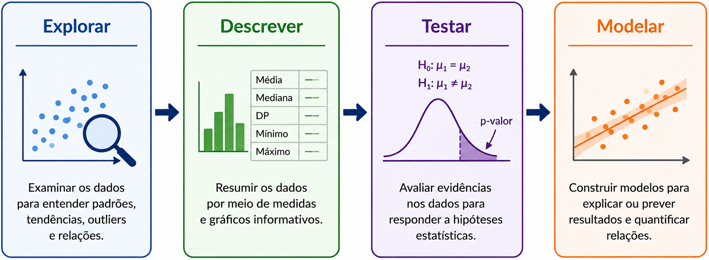
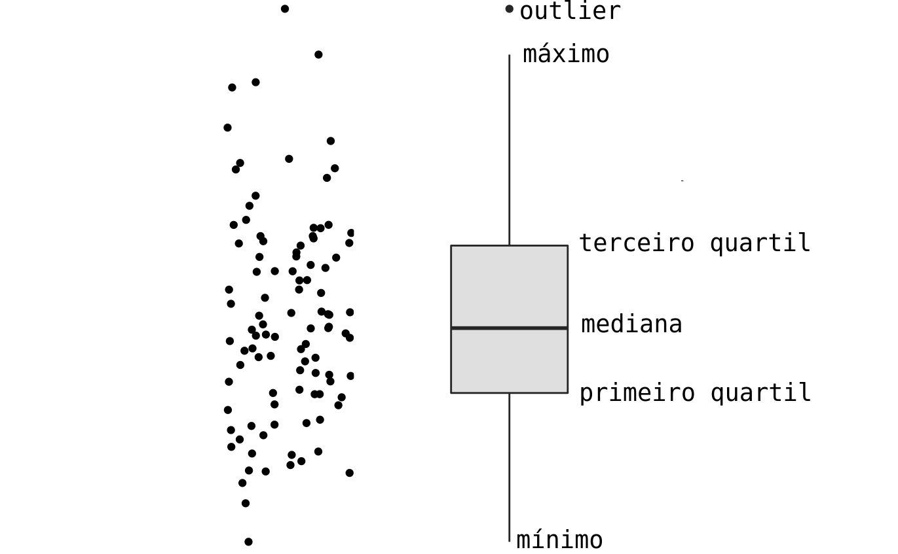
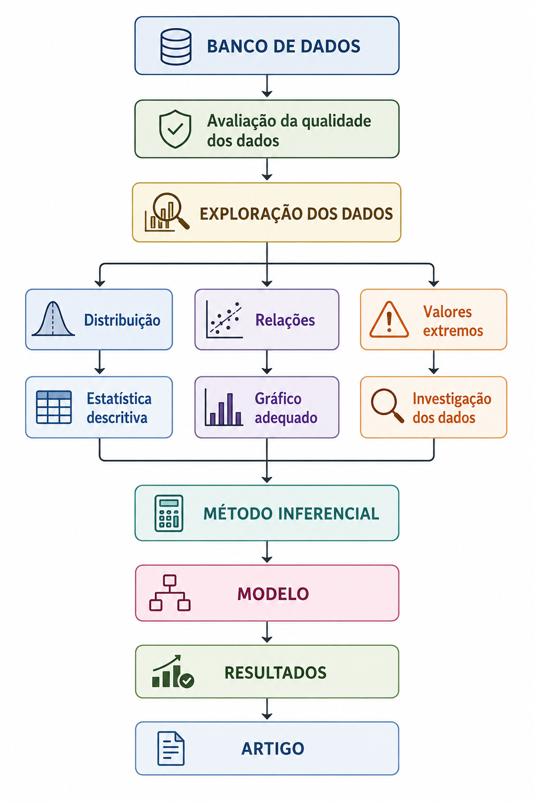

# O papel da análise exploratória em um artigo científico


## Por que explorar os dados?

- O objetivo da **análise exploratória** é entender os dados que estamos analisando.
- Isso nos ajuda a entender sobre qual população as inferências de uma pesquisa serão válidas.
- A análise exploratória permite identificar:

::::{.columns}

:::{.column width="2%"}

:::

:::{.column width="48%"}

- padrões
- distribuições
- diferenças

:::

:::{.column width="50%"}

- associações
- valores extremos
- inconsistências

:::
::::

- Ela ajuda a transformar um banco de dados em **evidência compreensível**.


## Exemplo

- Um estudo avaliou a concentração plasmática de um fármaco em 120 pacientes.
- Antes de comparar os tratamentos, precisamos saber:
  - Como as concentrações estão distribuídas?
  - Existem valores extremos?
  - A distribuição é aproximadamente simétrica?
  - Há diferenças aparentes entre os grupos?
  - Existem dados faltantes?
- **Explorar é entender antes de concluir.**


## O que é análise exploratória de dados?

- É o conjunto de procedimentos utilizados para **investigar, resumir e visualizar os dados**, buscando identificar estruturas e padrões relevantes.
- Inclui:

::::{.columns}

:::{.column width="2%"}

:::

:::{.column width="48%"}

- inspeção dos dados;
- estatísticas descritivas;
- tabelas;
- gráficos;

:::

:::{.column width="50%"}

- identificação de padrões;
- identificação de valores discrepantes;
- avaliação da distribuição das variáveis;
- investigação inicial de associações.

:::
::::

- **Objetivo principal:** Descobrir como os dados se comportam antes de decidir como analisá-los.


## Explorar não é testar

- Na exploração, perguntamos: "O que está acontecendo nos meus dados?"
- No teste de hipótese, perguntamos: "Os dados fornecem evidência suficiente para uma determinada hipótese?"
- **Exemplo:** Estudo com 3 tratamentos para hipertensão.

::::{.columns}

:::{.column width="2%"}

:::

:::{.column width="48%"}

#### Exploração:
- Visualizar a pressão arterial em cada grupo;
- Calcular média, mediana e dispersão;
- Identificar valores extremos.

:::

:::{.column width="50%"}

#### Inferência:
- Testar se há evidência de diferença entre os tratamentos.

:::
::::

- **Primeiro:** entender os dados. **Depois:** testar hipóteses.


## Quatro etapas diferentes

| Etapa                | Pergunta principal                        | Exemplo                                    |
| -------------------- | ----------------------------------------- | ------------------------------------------ |
| **Explorar**         | O que há nos dados?                       | Existem valores extremos?                  |
| **Descrever**        | Como resumir os dados?                    | Mediana = 12,4 mg/L                        |
| **Testar hipóteses** | Há evidência de uma diferença/associação? | Os tratamentos diferem?                    |
| **Modelar**          | Como explicar ou prever um desfecho?      | Quais fatores estão associados à resposta? |

- Essas etapas são relacionadas, mas não são sinônimas.


## Exploração

- Busca compreender a estrutura dos dados sem partir imediatamente para uma conclusão inferencial. Algumas perguntas típicas são:

::::{.columns}
:::{.column width="2%"}

:::

:::{.column width="48%"}

- Como os dados estão distribuídos?
- Há assimetria?
- Existem valores extremos?

:::

:::{.column width="50%"}

- Existem grupos distintos?
- Há associação entre variáveis?
- Existem padrões inesperados?

:::
::::

- **Exemplo:** Concentração plasmática.

$$2{,}1 \quad 2{,}4 \quad 2{,}7 \quad 3{,}0 \quad 3{,}2 \quad 3{,}4 \quad 3{,}8 \quad 15{,}7 ~~ mg/L$$

- Antes de realizar qualquer teste precisamos verificar se o valor 15,7 é um erro ou uma observação real (Exploração).


## Descrição

- Resume quantitativamente aquilo que foi observado. $\phantom{aaaaaaaaaaaaaaaaaaaa}$

::::{.columns}
:::{.column width="2%"}

:::

:::{.column width="48%"}

#### Variáveis categóricas

- Frequência absoluta;
- Frequência relativa;
- Proporção.

:::

:::{.column width="50%"}

#### Variáveis quantitativas

- Média;
- Mediana;
- Desvio-padrão;
- Intervalo interquartil;
- Quantis.

:::
::::

- **Exemplo:** Em 120 pacientes, 72 são mulheres (60%), com idade 54,2 ± 11,3 anos e concentração plasmática de 8,7 (6,1–12,4) mg/L.


## Testar hipóteses

- Utiliza uma amostra para produzir conclusões sobre uma população ou avaliar hipóteses científicas.
- Aqui temos inferência estatítica e não análise exploratória.
- **Exemplo:** A concentração plasmática média difere entre dois tratamentos?
  - Hipóteses:
    - $H_0:$ não há diferença entre os tratamentos.
    - $H_1$: há diferença entre os tratamentos.
- O teste estatístico produz evidências para avaliar essas hipóteses.
- **Importante:** Um teste estatístico **não substitui a exploração dos dados**.


## Modelagem estatística

- Busca representar matematicamente a relação entre variáveis.
- **Exemplo:** Quais fatores estão associados à concentração plasmática do fármaco?

::::{.columns}
:::{.column width="2%"}

:::

:::{.column width="48%"}

#### Possíveis variáveis:

- dose;
- idade;
- peso;
- função renal;
- sexo;
- interação medicamentosa.

:::

:::{.column width="50%"}

#### Um modelo pode permitir:

- estimar associações;
- controlar variáveis de confusão;
- quantificar efeitos;
- realizar previsões.

:::
::::

$$\text{Concentração} = \beta_0 + \beta_1(\text{dose}) +\beta_2(\text{idade}) + \beta_3(\text{função renal}) + \varepsilon$$


## As quatro etapas de análise de dados

<p align="center">
  
</p>

- **Explorar:** Como os dados se comportam?
- **Descrever:** Como posso resumir esse comportamento?
- **Testar:** Há evidência estatística para a hipótese?
- **Modelar:** Como as variáveis se relacionam e quanto cada uma contribui?


## Uma boa análise exploratória precisa responder perguntas

- Uma boa análise exploratória deve permitir responder:
  - Quem foi estudado?
  - O que foi medido?
  - Como cada variável se distribui?
  - Há dados faltantes ou inconsistentes?
  - Existem valores extremos?
  - Há diferenças aparentes entre grupos?
  - Existem associações entre variáveis?
  - Há padrões ao longo do tempo?


## Para cada variável, pergunte:

1. O que é? (Qual é o tipo variável?)
2. Como se distribui? (Quais valores são frequentes? Há assimetria?)
3. Há problemas? (Observações faltantes, valores impossíveis ou extremos?)
4. Há relações? (A variável parece associada a outras?)
5. O que isso implica? (Como devo descrever, visualizar e analisar essa variável?)

- **Exemplo:** Concentração plasmática (mg/L)

::::{.columns}
:::{.column width="2%"}

:::

:::{.column width="48%"}

- quantitativa contínua
- assimétrica à direita

:::

:::{.column width="50%"}

- 3 valores extremos
- maior concentração aparente no grupo tratado com dose alta

:::
::::

- Isso já produz decisões analíticas.


## A exploração orienta a estatística descritiva

- A escolha da estatística descritiva **não deve ser automática**.
- A distribuição dos dados orienta como resumir os dados.
- Exemplo:
  - Distribuição aproximadamente simétrica: média ± desvio-padrão
    - Idade (distribuição aproximadamente simétrica): 52,4 ± 11,2 anos
  - Distribuição assimétrica: mediana (intervalo interquartil -- IQQ)
    - Concentração plasmática (distribuição assimétrica): 8,4 (5,7--13,8) mg/L


## Não existe "uma estatística certa" para toda variável

- A mesma variável pode exigir diferentes formas de resumo dependendo dos dados.
- **Exemplo:** Considere a concentração plasmática de um fármaco.
  - média = 18,7 mg/L
  - mediana = 10,2 mg/L
  - A diferença entre as duas medidas sugere que **alguns valores elevados estão deslocando a média para cima**.
  - Precisamos investigar:

::::{.columns}
:::{.column width="5%"}

:::

:::{.column width="45%"}

- histograma;
- boxplot;

:::

:::{.column width="50%"}

- valores extremos;
- assimetria.

:::
::::


## A exploração orienta o gráfico

| Situação | Gráfico |
|---|---|
| Categórica | Barras |
| Quantitativa | Histograma |
| Quantitativa | Boxplot |
| Quantitativa × quantitativa | Dispersão |
| Quantitativa × categórica | Boxplot / pontos |
| Evolução temporal | Linhas |
| Duas categóricas | Barras / tabela |


## O gráfico pode revelar o que a média esconde

Considere dois grupos:

- Grupo A: $10,\;11,\;12,\;13,\;14$
- Grupo B: $2,\;3,\;4,\;21,\;30$

- As médias podem ser semelhantes, mas as distribuições são completamente diferentes.
- A visualização permite perceber:

::::{.columns}
:::{.column width="2%"}

:::

:::{.column width="48%"}

- dispersão;
- assimetria;
- agrupamentos;

:::

:::{.column width="50%"}

- valores extremos;
- diferenças entre grupos.

:::
::::

- Nunca analise isoladamente uma medida-resumo!


## A exploração orienta o teste estatístico

Antes de comparar grupos, precisamos saber:

- qual é o desfecho;
- quantos grupos existem;
- se os dados são independentes;
- como a variável se distribui;
- se existem valores extremos importantes;
- qual é a escala de medida.


## A exploração orienta o teste estatístico

**Exemplo:** Concentração plasmática em dois grupos.

**Exploração:**

- variável quantitativa;
- grupos independentes;
- distribuição aproximadamente simétrica.
  1. uma possibilidade é o **teste *t* para grupos independentes**.
  2. Se a distribuição for fortemente assimétrica, pode ser necessário considerar outra abordagem, como Mann-Whitney.

- **O teste é consequência da estrutura dos dados.**


## Exemplo -- Estudo famarcêutico

**Pergunta:** Um novo fármaco reduz a pressão arterial?

- Banco de dados: $\phantom{aaaaaaaaaaaaaaaaaaaaaaaaaaaaaaaaaaaaaaaaaaaaaa}$

::::{.columns}
:::{.column width="2%"}

:::

:::{.column width="48%"}

- $n=180$ pacientes;
- grupo controle e tratamento;
- pressão arterial;
- idade;

:::

:::{.column width="50%"}

- sexo;
- pressão basal;
- pressão após 12 semanas.

:::
::::


## Exemplo -- Estudo famarcêutico

- Exploração:
  - Há dados faltantes?
  - A pressão arterial apresenta distribuição aproximadamente simétrica?
  - Existem valores extremos?
  - Os grupos apresentam características diferentes?
  - Idade ou pressão basal parecem relacionadas ao desfecho?

- As respostas orientam:

::::{.columns}
:::{.column width="2%"}

:::

:::{.column width="48%"}

- estatística descritiva
- gráficos

:::

:::{.column width="50%"}

- teste ou modelo
- apresentação dos resultados

:::
::::


# Qualidade dos dados


## Dados

- Uma análise estatística é tão confiável quanto os dados que a alimentam.
- Antes de calcular médias, utilizar testes ou modelos, precisamos verificar:
  - estrutura do banco;
  - valores possíveis;
  - codificação;
  - unidades;
  - duplicações;
  - dados faltantes;
  - valores extremos.
- **Erro no banco → análise incorreta → resultado incorreto → conclusão incorreta.**


## Exemplo de banco de dados

| id | grupo | idade | sexo | oleosidade_baseline | oleosidade_8sem | 
|---:|:---|---:|:---|---:|---:|---:|---:|:---|
| 001 | Controle | 34 | F | 72 | 69 |
| 002 | Controle | 29 | F | 68 | 70 |
| 003 | Controle | 41 | M | 75 | 73 |
| 004 | Tratamento | 32 | F | 71 | 52 |
| 005 | Tratamento | 37 | F | 69 | 48 |
| 006 | Tratamento | 45 | M | 77 | 54 |

- Cada linha representa um participante. Cada coluna representa uma variável.


## Inspeção inicial do banco de dados

Antes de analisar, precisamos conhecer a estrutura do banco:

Antes da análise, verifique:

- número de participantes e variáveis;
- tipo e unidade de cada variável;
- valores mínimos e máximos;
- dados faltantes;
- duplicações;
- códigos e categorias.

**O que fazer:** documente a estrutura do banco e faça uma checagem sistemática antes da análise.


## Valores impossíveis ou biologicamente absurdos

Exemplos:

- idade = 250 anos;
- peso = −20 kg;
- pH = 25;
- concentração = −5 mg/L.

**O que fazer:** verificar a fonte original; corrigir apenas se houver evidência de erro e, se não for possível confirmar, tratar como dado faltante.


### Erros de codificação

**Exemplo:** sexo (1 = feminino, 2 = masculino)

- Dados: $1 \quad 2 \quad 1 \quad 7 \quad 2$
- O 7 pode ser erro, categoria desconhecida ou outra codificação.

**O que fazer:** consultar o dicionário do banco/protocolo antes de recodificar.


## Unidades de medida inconsistentes

- Uma mesma variável pode estar em escalas diferentes.

**Exemplo:** Concentração na mesma base de dados medida em

- mg/L
- µg/mL
- ng/mL

**O que fazer:** converter todas as observações para uma única unidade antes da análise.


## Dados duplicados

Exemplo:

| ID  | Grupo      | Idade |
| --- | ---------- | ----: |
| 101 | Controle   |    35 |
| 102 | Tratamento |    41 |
| 101 | Controle   |    35 |

- O participante 101 aparece duas vezes.

**O que fazer:** confirmar se é duplicação ou medida repetida; remover apenas duplicações indevidas.


## Dados faltantes -- *missing data*

- Um dado faltante ocorre quando uma informação esperada não foi registrada.
- Exemplo:

| ID  | Grupo      | Idade | Oleosidade |
| --- | ---------- | ----: | ---------: |
| 001 | Controle   |    34 |         72 |
| 002 | Controle   |    29 |         NA |
| 003 | Tratamento |    41 |         58 |

**O que fazer:** quantifique a proporção de missing e investigue seu padrão antes de decidir como tratá-los.


## Dados faltantes -- *missing data*

#### Quando eliminar ou imputar?

- Se há poucos valores faltantes e ausência aparentemente aleatória, pode ser aceitável fazer **análise por casos completos** (*complete-case analysis*).
  - Nesse caso, removem-se os participantes com dados faltantes.
- Se a quantidade dados faltantes é relevante ou há um padrão relacionado às características dos participantes, deve-se considerar **imputação múltipla**.
  - Pode-se usar métodos de imputação como **MICE** (*Multivariate Imputation by Chained Equations, ou Imputação Múltipla por Equações Encadeadas*).

- **Não imputar** quando o valor representa uma categoria estruturalmente ausente, como "não aplicável".
- Não existe um percentual universal que determine quando imputar: a decisão depende da quantidade, do padrão e do mecanismo dos dados faltantes.


## Valores extremos

Um valor extremo pode ser:

- erro de digitação;
- erro de unidade;
- erro de medição;
- observação biologicamente verdadeira.

Exemplo:

$$7,1 \quad 7,8 \quad 8,2 \quad 8,5 \quad 9,0 \quad 31,7$$

**O que fazer:** investigar a origem do valor antes de decidir qualquer exclusão.


# Descrição de Variáveis Qualitativas


## Variável qualitativa: como descrever?

Uma variável qualitativa representa **categorias**, e sua descrição é feita principalmente por:

- **Frequência absoluta** → $n$
- **Frequência relativa** → proporção
- **Percentual** → %

**Principais formas de apresentação**

| Tipo de variável | Descrição | Gráfico |
|---|---|---|
| Nominal | n (%) | Barras |
| Ordinal | n (%) | Barras ordenadas |
| Binária | n (%) | Barras |


## Frequência absoluta

- Mostra o número de indivíduos em cada categoria. $\phantom{aaaaaaaaaaaa}$

::::{.columns}
:::{.column width="20%"}

- Exemplo:

:::

:::{.column width="80%"}

| Reação adversa | n |
|---|---:|
| Sim | 18 |
| Não | 82 |

:::
::::

::::{.columns}
:::{.column width="50%"}

**Vantagens**

- Simples;
- Fácil interpretação;
- Mantém o tamanho real de cada grupo.

:::

:::{.column width="50%"}

**Desvantagens**

- Dificulta comparações entre amostras de tamanhos diferentes.

:::
::::


## Frequência relativa

- Expressa a participação de cada categoria na amostra.
- Dada por: $$\frac{\text{frequência da categoria}}{\text{tamanho da amostra}}$$

**Exemplo**: Se uma categoria tem 18 pacientes e a amostra 100,

$$
f_{i}=\frac{18}{100}=0{,}18 \quad \text{ou } 18\%
$$

::::{.columns}
:::{.column width="50%"}

**Vantagens**

- Permite comparar amostras de tamanhos diferentes.

:::

:::{.column width="50%"}

**Desvantagens**

- Menos intuitiva que a frequência absoluta para amostras pequenas.

:::
::::


## Tabela de frequência

- Dados categóricos podem ser organizados em frequências e percentuais em uma tabela.

| Evento adverso | n | % |
|---|---:|---:|
| Náusea | 15 | 15,0 |
| Cefaleia | 10 | 10,0 |
| Rash | 5 | 5,0 |
| Nenhum | 70 | 70,0 |

::::{.columns}
:::{.column width="50%"}

**Vantagens**

- Precisa;
- Compacta;
- Fácil de comparar categorias.

:::

:::{.column width="50%"}

**Desvantagens**

- Menos visual que um gráfico.

:::
::::


## Gráfico de barras

- Para uma variável categórica, uma das melhores visualizações é o **gráfico de barras**.
- Cada categoria da variável é representada por uma barra cuja altura corresponde à frequência.
- Facilita a visualização e comparação das frequências entre categorias.

::::{.columns}
:::{.column width="50%"}

**Vantagens**

- Intuitivo;
- Fácil comparação;
- Adequado para muitas categorias.

:::

:::{.column width="50%"}

**Desvantagens**

- Menos preciso que uma tabela;
- Pode ficar poluído com muitas categorias.

:::
::::


# Descrição de variáveis quantitativas


## Variável quantitativa: como descrever?

Uma variável quantitativa representa **valores numéricos**.

Para descrevê-la, precisamos avaliar:

- **Tendência central** → onde os dados se concentram
- **Dispersão** → quanto os dados variam
- **Posição** → como os valores se distribuem
- **Forma** → simetria e assimetria


## Variável quantitativa: como descrever?

**Principais medidas**

| Aspecto | Medidas |
|---|---|
| Tendência central | Média, mediana, moda |
| Posição | Quartis, percentis |
| Dispersão | Amplitude, variância, DP, IIQ, CV |
| Forma | Assimetria |

- **Uma única medida não descreve adequadamente uma distribuição.**


## Por que uma única medida não é suficiente?

Considere:

- Grupo A: 48, 49, 50, 51, 52
- Grupo B: 20, 30, 50, 70, 80
  - Ambos possuem média igual a 50, mas apresentam distribuições muito diferentes.

**O que fazer:** apresentar uma medida de tendência central **e** uma medida de dispersão.

- **Centro sem dispersão fornece uma visão incompleta dos dados.**


## Média

- Soma de todos os valores dividida pelo número de observações.
- **Para que serve:** Representar o centro dos dados.
- **Quando usar:** Distribuição dos dados é **simétrica**.
- **Vantagens:**
  - Utiliza todas as observações;
  - Base para diversos métodos estatísticos.
- **Desvantagens:**
  - Sensível a valores extremos;
  - Pode ser pouco representativa em distribuições muito assimétricas.
- **Exemplo:** Dose média = 52,4 mg/dia


## Mediana

- Valor que divide os dados ordenados ao meio.
- Representar a posição central da distribuição.
- **Quando usar:** Distribuição dos dados é **assimétrica** ou há muitos valores extremos.
- **Vantagens:**
  - Pouco influenciada por valores extremos;
  - Adequada para distribuições assimétricas.
- **Desvantagens:**
  - Não utiliza diretamente a magnitude de todos os valores.
- **Exemplo:** Concentração mediana = 8,4 mg/L


## Moda

- Valor que ocorre com maior frequência.
- **Para que serve:** Identificar o valor mais frequente.
- **Quando usar:** Quando o valor mais frequente possui interesse prático.
- **Vantagens:**
  - Fácil interpretação;
  - Pode ser utilizada quando a média não é adequada.
- **Desvantagens:**
  - Pode não existir;
  - Pode haver mais de uma moda;
  - Pouco informativa para muitas variáveis contínuas.
- **Exemplo:** Dose mais frequente = 50 mg/dia


## Quantis

- Valores que dividem os dados ordenados em determinadas proporções.
- **Para que serve:** Descrever a posição dos valores na distribuição.
- **Quando usar:** Quando interessa conhecer a posição relativa das observações.
- **Vantagens:**
  - Úteis para descrever a distribuição;
  - Pouco influenciados por valores extremos.
- **Desvantagens:**
  - Não resumem diretamente toda a variabilidade.
- **Exemplo:** P90 = 18,5 mg/L


## Quartis

- Dividem os dados ordenados em quatro partes.
- **Para que serve:** Descrever a posição e a distribuição dos dados.
- **Principais quartis:**
  - Q1 = P25;
  - Q2 = P50 = mediana;
  - Q3 = P75.
- **Vantagens:**
  - Fáceis de interpretar;
  - Fundamentais para o cálculo do IIQ e do boxplot.
- **Desvantagens:**
  - Não descrevem toda a distribuição.
- **Exemplo:** Q1 = 5,7 mg/L; Q3 = 13,8 mg/L


## Percentis

- Valor abaixo do qual está determinada proporção dos dados.
- **Para que serve:** Identificar a posição de uma observação dentro da distribuição.
- **Quando usar:** Quando pontos de corte ou posições específicas da distribuição são relevantes.
- **Vantagens:**
  - Fácil interpretação;
  - Úteis para estabelecer referências.
- **Desvantagens:**
  - Percentis extremos podem ser instáveis em amostras pequenas.
- **Exemplo:** P95 = 21,4 mg/L


## Amplitude

- Diferença entre o maior e o menor valor.
- **Para que serve:** Medir a extensão total dos dados.
- **Quando usar:** Para uma descrição rápida da variação observada.
- **Vantagens:**
  - Simples;
  - Fácil interpretação.
- **Desvantagens:**
  - Utiliza apenas dois valores;
  - Muito sensível a valores extremos.
- **Exemplo:** Concentração = 5,2–31,7 mg/L


## Variância

- Média dos desvios quadráticos em relação à média.
- **Para que serve:** Quantificar a variabilidade dos dados.
- **Quando usar:** Principalmente como base para outros métodos estatísticos.
- **Vantagens:**
  - Fundamental para diversos procedimentos estatísticos;
  - Utiliza todas as observações.
- **Desvantagens:**
  - Unidade fica elevada ao quadrado;
  - Pouco intuitiva para interpretação.
- **Exemplo:** Variância da concentração = 16,4 (mg/L)²


## Desvio-padrão

- Raiz quadrada da variância.
- **Para que serve:** Quantificar a dispersão dos dados na mesma unidade da variável.
- **Quando usar:** Distribuição aproximadamente simétrica.
- **Vantagens:**
  - Fácil interpretação;
  - Amplamente utilizado em artigos científicos.
- **Desvantagens:**
  - Sensível a valores extremos;
  - Menos adequado para distribuições muito assimétricas.
- **Exemplo:** Pressão arterial = 128 ± 14 mmHg


## Intervalo interquartil — IIQ

- Diferença entre o terceiro e o primeiro quartil.
- $IIQ = Q_3 - Q_1$
- **Para que serve:** Medir a dispersão dos 50% centrais dos dados.
- **Quando usar:** Distribuições assimétricas ou com valores extremos.
- **Vantagens:**
  - Pouco influenciado por valores extremos;
  - Adequado para distribuições assimétricas.
- **Desvantagens:**
  - Ignora os 50% extremos da distribuição.
- **Exemplo:** Q1 = 5,7; Q3 = 13,8 → IIQ = 8,1 mg/L


## Coeficiente de variação — CV

- Relação entre o desvio-padrão e a média.
- \[
  CV = \frac{s}{\bar{x}}\times100
  \]
- **Para que serve:** Comparar a variabilidade relativa entre medidas.
- **Quando usar:** Quando interessa comparar precisão/variabilidade em diferentes escalas.
- **Vantagens:**
  - Permite comparação relativa;
  - Muito útil em Ciências Farmacêuticas.
- **Desvantagens:**
  - Inadequado quando a média é próxima de zero;
  - Não deve ser utilizado indiscriminadamente.
- **Exemplo:** Método A = CV 4,2%; Método B = CV 11,8%


## Média ± desvio-padrão

- A média sempre deve ser apresentada com o desvio-padrão.
- **Para que serve:** Resumir centro e dispersão.
- **Quando usar:** Distribuição aproximadamente **simétrica**.
- **Vantagens:**
  - Compacta;
  - Amplamente utilizada em artigos científicos.
- **Desvantagens:**
  - Sensível a valores extremos;
  - Pode representar mal distribuições assimétricas.
- **Exemplo:** Idade = **52,4 ± 11,3 anos**


## Mediana (IIQ)

- Apresentação da mediana deve sermpre vir acompanhada do intervalo interquartil.
- **Para que serve:** Resumir centro e dispersão de uma distribuição.
- **Quando usar:** Distribuição **assimétrica** ou com valores extremos relevantes.
- **Vantagens:**
  - Robusta a valores extremos;
  - Adequada para distribuições assimétricas.
- **Desvantagens:**
  - Não utiliza diretamente todos os valores;
  - Menos informativa quando a distribuição é aproximadamente simétrica.
- **Exemplo:** Concentração = **8,4 (5,7–13,8) mg/L**


## Média × mediana

- A relação entre média e mediana ajuda a identificar assimetria.
- **Distribuição aproximadamente simétrica:** $\text{média} \approx \text{mediana}$
- **Distribuição assimétrica:** $\text{média} \neq \text{mediana}$
- **Para que serve:** Orientar a escolha da estatística descritiva.
- **Exemplo:**
  - Média = 18,7 mg/L;
  - Mediana = 10,2 mg/L.
- **Interpretação:** Possível influência de valores elevados.


## Relação entre distribuição e estatística descritiva

- Primeiro observe a distribuição; depois escolha como resumir os dados.

| Distribuição | Tendência central | Dispersão |
|---|---|---|
| Aproximadamente simétrica | Média | DP |
| Assimétrica | Mediana | IIQ |
| Valores extremos relevantes | Mediana | IIQ |

- **Regra prática:**
  - Simétrica → **média ± DP**;
  - Assimétrica → **mediana (IIQ)**.
- **Cuidado:** A escolha não deve depender apenas de um teste de normalidade.
- **O que fazer:** Avaliar a distribuição com **histograma, boxplot e medidas descritivas**.


# Visualização de variáveis quantitativas (numéricas)


## Histograma

```{r}
#| echo: false
#| eval: true
#| warning: false
#| message: false

library(ggplot2)
library(patchwork)

set.seed(123)

dados <- data.frame(
  idade = round(rnorm(1000, mean = 48, sd = 10))
)

dados2 <- data.frame(
  concentracao = rlnorm(1000, meanlog = 2, sdlog = 0.45)
)

grafico_idade <- ggplot(dados, aes(x = idade)) +
  geom_histogram(
    binwidth = 5,
    boundary = 0,
    fill = "#1f4e77",
    color = "white"
  ) +
  labs(
    x = "Idade (anos)",
    y = "Frequencia"
  ) +
  theme_minimal(base_size = 14)

grafico_concentracao <- ggplot(dados2, aes(x = concentracao)) +
  geom_histogram(
    binwidth = 2,
    boundary = 0,
    fill = "#296e3f",
    color = "white"
  ) +
  labs(
    x = "Concentracao plasmatica (mg/L)",
    y = "Frequencia"
  ) +
  theme_minimal(base_size = 14)

grafico_idade + grafico_concentracao
```


## Histograma

- **Para que serve:** visualizar a forma da distribuição.
- **Eixo x:** valores ou intervalos da variável.
- **Eixo y:** frequência, frequência relativa ou densidade.
- Cada barra representa um **intervalo de valores**.
- A largura da barra representa a **amplitude do intervalo**.
- A altura representa a quantidade relativa de observações.
- **Observe:** centro, dispersão, assimetria, valores extremos e possíveis múltiplos grupos.
- O formato geral é mais importante que cada barra individual.


## Histograma -- Distribuição aproximadamente simétrica

```{r}
#| echo: false
#| eval: true
#| warning: false
#| message: false

grafico_idade
```

- Caudas aproximadamente semelhantes.
- Centro bem definido.
- Média e mediana tendem a ser próximas.
- Nesse caso, média ± DP pode ser uma representação adequada.


## Histograma -- Assimetria à direita

```{r}
#| echo: false
#| eval: true
#| warning: false
#| message: false

grafico_concentracao
```

- Maior concentração de observações em valores baixos.
- Cauda prolongada para valores altos.
- Média tende a ser maior que a mediana.
- Nesse caso deve-se considerar mediana (IIQ) e investigar valores elevados.


## Histograma -- Assimetria à esquerda

```{r}
#| echo: false
#| eval: true
#| warning: false
#| message: false

set.seed(123)

dados3 <- data.frame(hemoglobina = 8 + 8 * rbeta(1000, shape1 = 6, shape2 = 2))

ggplot(dados3, aes(x = hemoglobina)) +
  geom_histogram(
    binwidth = 0.5,
    boundary = 8,
    fill = "#de163b",
    color = "white"
  ) +
  labs(
    x = "Hemoglobina (g/dL)",
    y = "Frequencia"
  ) +
  theme_minimal(base_size = 14)
```

- Maior concentração de observações em valores altos.
- Cauda prolongada para valores baixos.
- Média tende a ser menor que a mediana.
- Nesse caso deve-se considerar mediana (IIQ) e investigar valores elevados.


## Histograma -- Distribuição multimodal

```{r}
#| echo: false
#| evl: true
#| warning: false
#| message: false

set.seed(123)

dados4 <- data.frame(
  concentracao = c(
    rnorm(500, mean = 6, sd = 1),
    rnorm(500, mean = 11, sd = 1.5)
  )
)

ggplot(dados4, aes(x = concentracao)) +
  geom_histogram(
    bins = 20,
    color = "white"
  ) +
  labs(
    x = "Concentração plasmática (mg/L)",
    y = "Frequência"
  ) +
  theme_minimal()
```

- Mais de um pico na distribuição.
- Pode indicar subgrupos, diferentes populações, diferentes tratamentos; ou mistura de mecanismos biológicos.
- Deve-se investigar se existem subgrupos antes de resumir todos os participantes com uma única média.


## Curva de densidade

```{r}
#| echo: false
#| eval: true
#| warning: false
#| message: false

densidade_idade <- ggplot(dados, aes(x = idade)) +
  geom_density(
    fill = "#1f4e77",
    color = "#1f4e77",
    alpha = 0.25,
    linewidth = 1.2
  ) +
  labs(
    #title = "Aproximadamente simétrica",
    x = "Idade (anos)",
    y = "Densidade"
  ) +
  theme_minimal(base_size = 14) +
  theme(
    plot.title = element_text(face = "bold")
  )

densidade_concentracao <- ggplot(dados2, aes(x = concentracao)) +
  geom_density(
    fill = "#296e3f",
    color = "#296e3f",
    alpha = 0.25,
    linewidth = 1.2
  ) +
  labs(
    #title = "Assimetria à direita",
    x = "Concentracao plasmatica (mg/L)",
    y = "Densidade"
  ) +
  theme_minimal(base_size = 14) +
  theme(
    plot.title = element_text(face = "bold")
  )

densidade_hemoglobina <- ggplot(dados3, aes(x = hemoglobina)) +
  geom_density(
    fill = "#de163b",
    color = "#de163b",
    alpha = 0.25,
    linewidth = 1.2
  ) +
  labs(
    #title = "Assimetria à esquerda",
    x = "Hemoglobina (g/dL)",
    y = "Densidade"
  ) +
  theme_minimal(base_size = 14) +
  theme(
    plot.title = element_text(face = "bold")
  )

densidade_multimodal <- ggplot(dados4, aes(x = concentracao)) +
  geom_density(
    fill = "#76539a",
    color = "#76539a",
    alpha = 0.25,
    linewidth = 1.2
  ) +
  labs(
    #title = "Distribuição multimodal",
    x = "Concentracao plasmatica (mg/L)",
    y = "Densidade"
  ) +
  theme_minimal(base_size = 14) +
  theme(
    plot.title = element_text(face = "bold")
  )

densidade_idade +
  densidade_concentracao +
  densidade_hemoglobina +
  densidade_multimodal +
  plot_layout(ncol = 2)
```

- É uma alternativa ao histograma.
- **Para que serve:** facilitar a visualização da forma geral da distribuição.
- **Vantagem:** permite comparar distribuições com diferentes tamanhos amostrais.


## Boxplot

```{r}
#| echo: false
#| eval: true
#| warning: false
#| message: false

library(ggplot2)

set.seed(123)

dados5 <- data.frame(
  tratamento = factor(
    rep(
      c(
        "Losartana",
        "Enalapril",
        "Amlodipino",
        "Hidroclorotiazida"
      ),
      each = 80
    ),
    levels = c(
      "Losartana",
      "Enalapril",
      "Amlodipino",
      "Hidroclorotiazida"
    )
  ),
  reducao_pas = c(
    rnorm(80, mean = 12, sd = 5),
    rnorm(80, mean = 20, sd = 5),
    rnorm(80, mean = 17, sd = 5),
    rnorm(80, mean = 14, sd = 5)
  )
)

ggplot(
  dados5,
  aes(
    x = tratamento,
    y = reducao_pas,
    fill = tratamento
  )
) +
  geom_boxplot(
    width = 0.6,
    linewidth = 0.8,
    color = "gray20",
    outlier.shape = 21,
    outlier.size = 2.5,
    outlier.fill = "white"
  ) +
  scale_fill_manual(
    values = c(
      "Losartana" = "#4C78A8",
      "Enalapril" = "#59A14F",
      "Amlodipino" = "#E3A23B",
      "Hidroclorotiazida" = "#C95C5C"
    )
  ) +
  labs(
    x = "Tratamento farmacologico",
    y = "Reducao da PAS (mmHg)"
  ) +
  theme_minimal(base_size = 15) +
  theme(
    legend.position = "none",
    panel.grid.minor = element_blank(),
    axis.title = element_text(face = "bold")
  )
```


## Boxplot

<p align="center">
  
</p>


## Boxplot

- Um boxplot permite comparar: posição central, dispersão, assimetria, valores extremos e distribuição entre grupos.
- **Exemplo:** Concentração plasmática.

| Grupo      | Mediana |      IIQ |
| ---------- | ------: | -------: |
| Controle   |     6,8 |  4,9–8,7 |
| Tratamento |    10,4 | 7,8–14,2 |

- **O que fazer:** use boxplots lado a lado quando a comparação entre grupos for importante.


## Histograma × boxplot

| Característica               | Histograma | Boxplot |
| ---------------------------- | ---------- | ------- |
| Forma da distribuição        | ★★★★★      | ★★      |
| Assimetria                   | ★★★★       | ★★★     |
| Valores extremos             | ★★★        | ★★★★★   |
| Comparação entre grupos      | ★★         | ★★★★★   |
| Detalhamento da distribuição | ★★★★★      | ★★      |

- **Histograma:** melhor para entender a **forma**.
- **Boxplot:** melhor para comparar **grupos e dispersão**.
- Os dois gráficos são **complementares**.


## Q-Q plot

```{r}
#| echo: false
#| eval: true
#| warning: false
#| message: false

set.seed(123)

dados <- data.frame(
  idade = rnorm(150, mean = 50, sd = 10)
)

ggplot(dados, aes(sample = idade)) +
  stat_qq(
    size = 5
  ) +
  stat_qq_line(
    color = "red",
    linewidth = 2
  ) +
  labs(
    x = "Quantis teoricos",
    y = "Quantis observados"
  ) +
  theme_minimal(base_size = 14)
```


## Q-Q plot

- Usado avaliar a compatibilidade dos dados com uma distribuição teórica.
- Para avaliar normalidade, compara-se com a **distribuição normal**.
  - Pontos próximos da linha → maior compatibilidade.
  - Curvaturas ou desvios sistemáticos → possíveis diferenças da normalidade.
  - Desvios nas extremidades → podem indicar caudas diferentes ou valores extremos.
- O Q-Q plot é mais informativo que simplesmente olhar média e mediana.


## Regra prática para visualizar uma variável quantitativa

1. **Histograma:** observe a forma.
2. **Boxplot:** observe dispersão e extremos.
3. **Q-Q plot:** avalie compatibilidade com uma distribuição teórica.
4. **Estatísticas:** compare média, mediana, DP e IIQ.
5. **Decisão:** escolha a forma adequada de descrever e analisar os dados.

- **Nenhum gráfico deve ser interpretado isoladamente.**


##

<p align="center">
  
</p>


# Fim