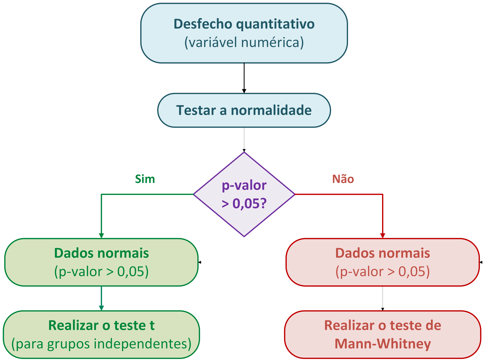
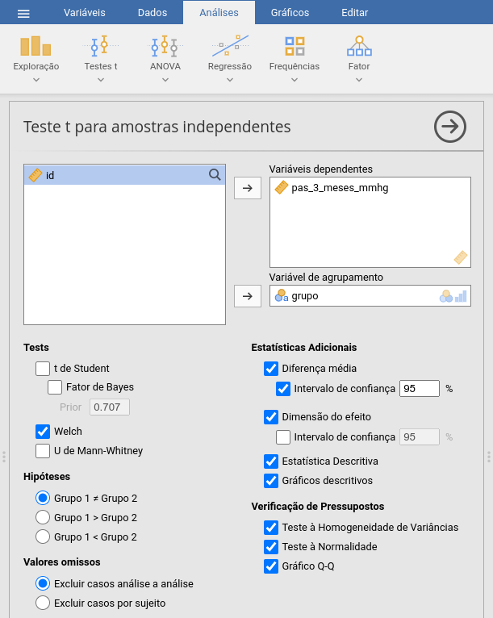
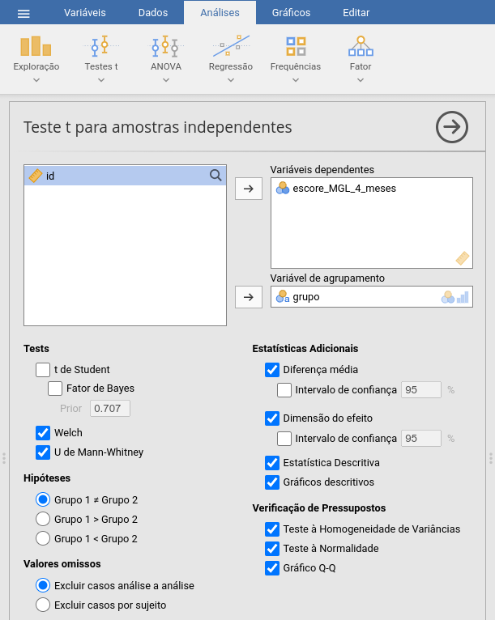
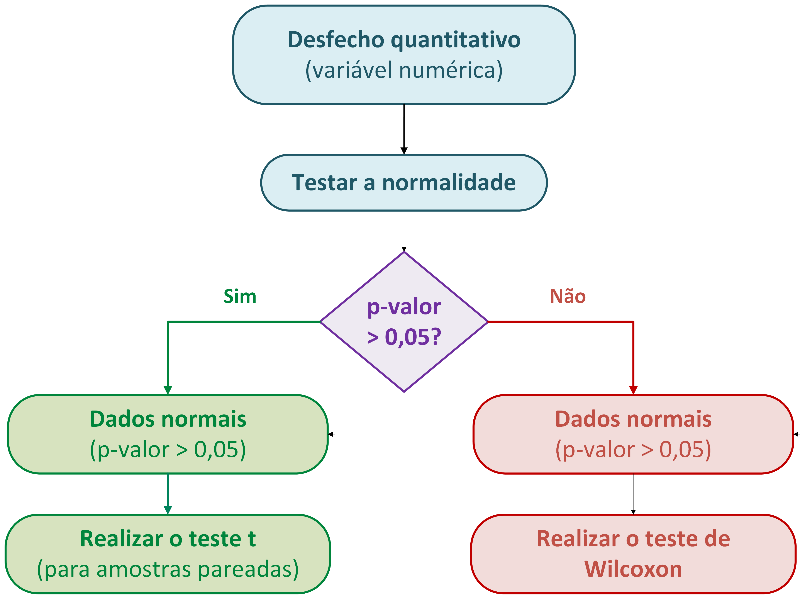
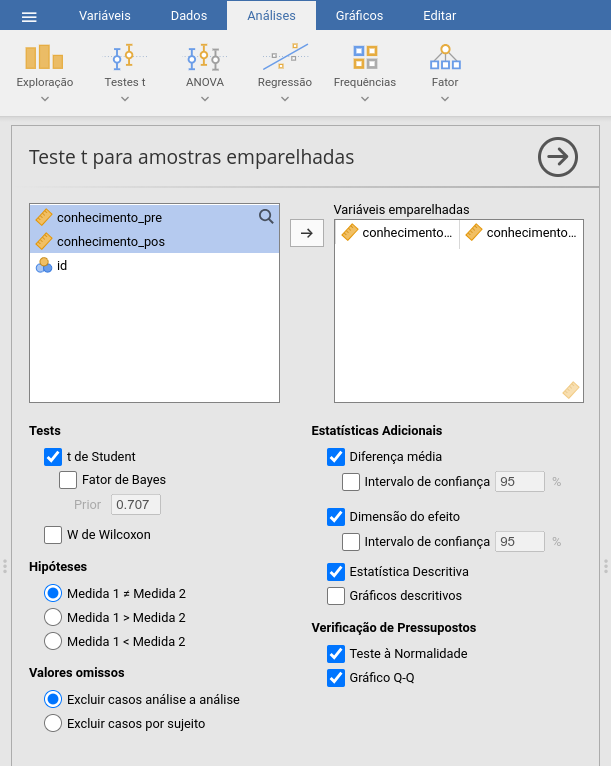
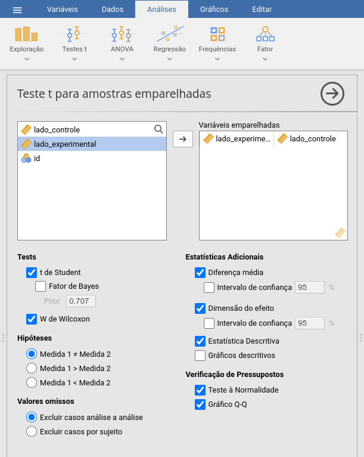
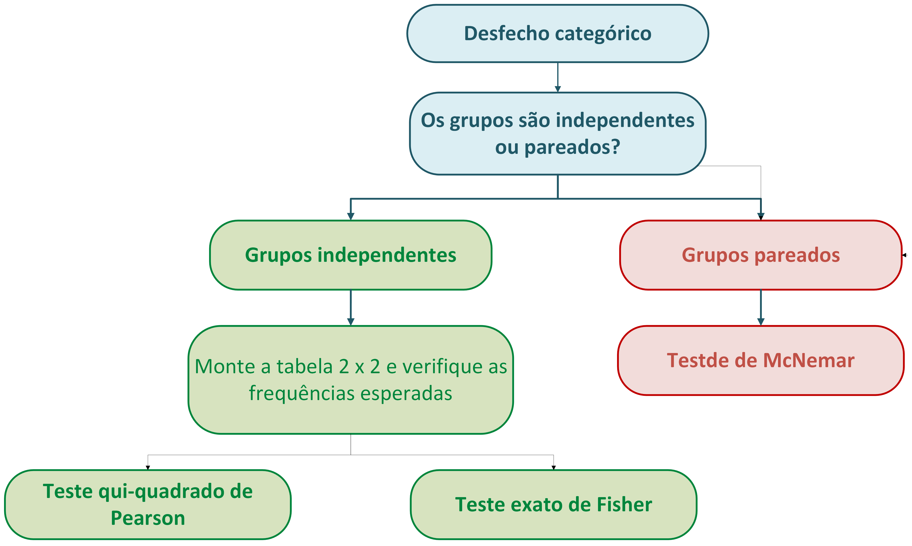
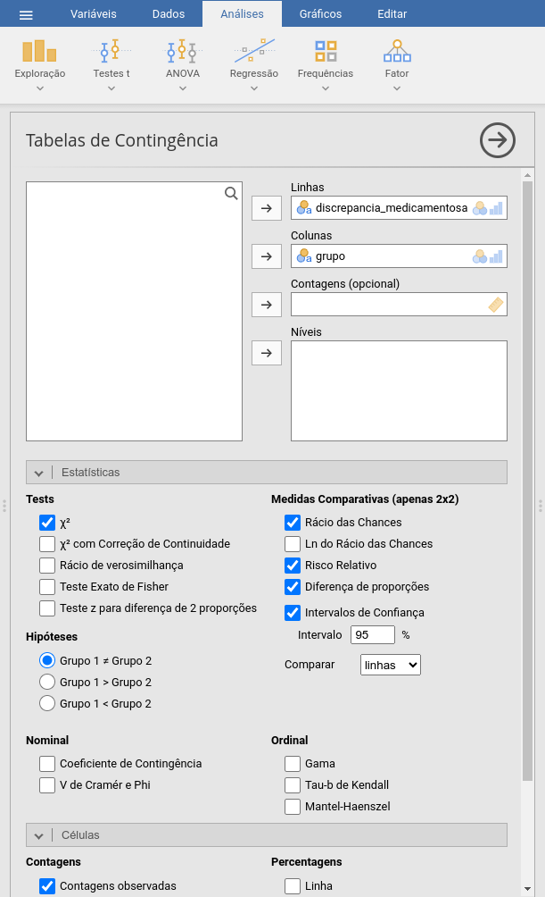
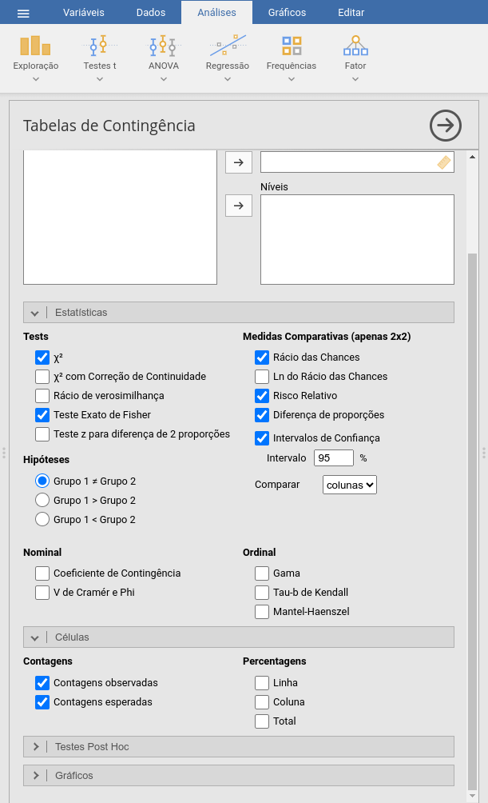
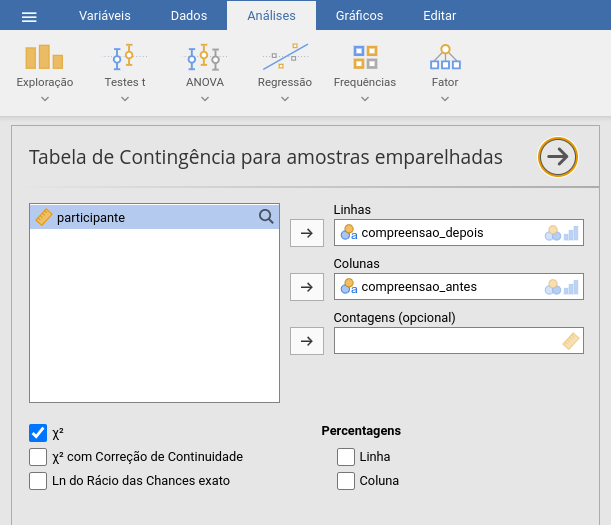

## Hipóteses

- **Hipótese** é uma afirmação sobre a população que queremos testar cientificamente.
- Para a análise estatística devemos traduzir a **pergunta científica** para uma **pergunta estaística**.

- **Exemplos:**
  - **Pergunta científica:** O novo medicamento reduz a pressão arterial mais que o tratamento controle?
  - **Pergunta estatística:** A pressão arterial média difere entre os grupos?
  
   

  - **Pergunta científica:** O tratamento reduz a ocorrência de eventos adversos?
  - **Pergunta estatística:** A proporção de pacientes com eventos adversos difere entre os grupos?

- **Não escolha o teste estatístico antes de definir a pergunta e o desfecho.**

## Hipótese Nula e Hipótese Alternativa

- **Hipótese nula ($H_0$):** representa a ausência de diferença ou efeito entre os grupos.

- **Hipótese alternativa ($H_1$):** representa a existência de diferença ou efeito entre os grupos.

 

- **A análise estatística busca avaliar se os dados fornecem evidências suficientes para rejeitar $H_0$.&&

## Teste Unilateral ou Bilateral

#### Teste Bilateral

- Pergunta se existe qualquer diferença entre os grupos ("É diferente?").
- **Exemplos:**
  - O novo medicamento produz uma pressão arterial média diferente da observada com o medicamento padrão?
  - A concentração plasmática média do fármaco genérico é diferente da do medicamento de referência?
  - A frequência de eventos adversos é diferente entre os pacientes que recebem o novo medicamento e o grupo controle?

## Teste Unilateral ou Bilateral

#### Teste Unilateral

- Pergunta se a diferença ocorre em uma direção específica ("É maior?" "É menor?").
-  **Exemplos:**
  - O novo medicamento reduz mais a pressão arterial do que o tratamento padrão?
  - A nova formulação aumenta a biodisponibilidade do fármaco em relação à formulação convencional?
  - O novo medicamento apresenta uma frequência de eventos adversos menor que a do tratamento padrão?

## O que define a escolha do teste?

Os testes de comparação de dois grupos são escolhidos principalmente com base em **três pilares**:

1. **Tipo de desfecho**
  
2. **Grupos independentes ou pareados**

3. **Pressupostos do teste**

## 1. Tipo de Desfecho

#### Desfecho Quantitativo

- Peso corporal (kg)
- Concentração plasmática do fármaco ($\mu\text{g/mL}$)
- Tempo até atingir concentração máxima (horas)

#### Desfecho Categórico (nominal) 

- Ocorrência de reação adversa (Sim / Não)
- Tipo de reação adversa (Gastrointestinal / Dermatológica / Neurológica / etc.)

#### Desfecho Ordinal
- Intensidade da dor	(Ausente → Leve → Moderada → Intensa)
- Nível de adesão ao tratamento	(Baixa → Moderada → Alta)

## 2. Grupos Independentes ou Pareados

#### Grupos Independentes

- As observações de um grupo não dependem das observações do outro.
- *Exemplos:*
  - Pressão arterial de pacientes que receberam fármaco A vs. fármaco B
  - Glicemia de pacientes que receberam tratamento vs. placebo
  - Escore de dor de homens vs. mulheres

#### Grupos Dependentes

- Existe uma correspondência entre as observações dos dois grupos.
- *Exemplos:*
  - Glicemia medida antes e após uma intervenção
  - Comparação entre dois medicamentos no mesmo paciente

## 3. Pressupostos

Antes de aplicar um teste, devemos verificar se seus pressupostos são atendidos.

#### Normalidade do desfecho

- Para desfechos quantitativos, o teste t exige normalidade
  - Verificamos usando o teste de Shapiro-Wilk junto com o qq-plot.
  - Se os dados não forem normais, usamos testes não-paramétricos (Ex.: Teste de Mann-Whitney ou Teste de Wilcoxon)

#### Qui-quadrado: frequências esperadas

- Para desfechos categóricos, o teste do qui-quadrado utiliza uma aproximação baseada nas **frequências esperadas** das células da tabela de contingência.
- Se há frequências esperadas muito pequenas, usamos o teste exato de Fisher.

# Testes para Desfechos Quantitativos

## Dois grupos independentes: Qual teste?

  

## Dois grupos independentes: Teste t

- Compara a **média** do desfecho entre dois grupos
- Pressupõe distribuição aproximadamente normal
- Use como padrão o teste t de Welch
- Informe:
  - Média ± desvio padrão de cada grupo
  - Diferença entre as médias + IC95%
  - Estatística t, graus de liberdade e p-valor
  - Tamanho do efeito: Cohen's d (0,00-0,19: desprezível; 0,20-0,49: pequeno; 0,50-0,79: moderado; ≥ 0,80: grande).
    - Cohen’s d padroniza a diferença entre as médias, permitindo comparar a magnitude do efeito mesmo quando os desfechos estão em escalas diferentes.

## Dois grupos Independentes: Teste de Mann-Whitney

- Compara a distribuição dos valores entre dois grupos independentes
- A variável pode ser quantitativa ou ordinal (escalas)
- Não exige distribuição normal
- Informe:
  - Mediana e intervalo interquartil (IIQ) de cada grupo
  - Estatística do teste (*U*) e p-valor
  - Tamanho do efeito: rank-biserial correlation ($r_{rb}$) (interpretação similar ao d de Cohen)

## Exemplo 3.1: Intervenção farmacêutica e pressão arterial

Um ensaio clínico randomizado avaliou a eficácia de uma intervenção conduzida por estudantes de Farmácia em adultos com hipertensão. Os participantes foram alocados para um grupo intervenção, que recebeu acompanhamento farmacêutico por mensagens de texto e consultas pessoais, ou para um grupo controle. Após três meses, foi medida a pressão arterial sistólica (PAS) dos participantes.

- Pergunta de pesquisa:** A intervenção farmacêutica reduz a pressão arterial sistólica após três meses, em comparação ao grupo controle?

- Dados: *exemplo3.1.csv*

## 

  

## Exemplo 3.1: Intervenção farmacêutica e pressão arterial

*Como reportar:*

A pressão arterial sistólica média foi menor no grupo intervenção em comparação ao grupo controle (135 ± 15,5 vs. 141 ± 15,2 mmHg). A diferença média foi de 6,20 mmHg (IC95%: 3,12–9,28), indicando menor pressão arterial sistólica no grupo intervenção. Essa diferença foi estatisticamente significativa (teste t de Welch: t = 3,96; gl = 382; p < 0,001), com tamanho de efeito pequeno a moderado (d de Cohen = 0,40).

## Exemplo 3.2.: Adesão ao tratamento medicamentoso

Um estudo avaliou a efetividade de um serviço farmacêutico individualizado para melhorar a adesão ao tratamento medicamentoso de pacientes com hipertensão arterial. Os participantes foram distribuídos em dois grupos independentes:

- *Intervenção farmacêutica:* acompanhamento individualizado;
- *Controle:* cuidado habitual.

Após quatro meses de acompanhamento, a adesão ao tratamento foi avaliada pelo escore de Morisky-Green-Levine (MGL), uma escala com valores de 0 a 4.

- **Pergunta de pesquisa:** O escore de adesão ao tratamento difere entre os pacientes que receberam a intervenção farmacêutica e aqueles do grupo controle?

- Dados: *exemplo3.2.csv*

##

  

## Exemplo 3.2.: Adesão ao tratamento medicamentoso

*Como reportar:*

O escore de adesão medicamentosa foi menor no grupo intervenção em comparação ao grupo controle (mediana [IQR]: 1 [0–1] vs. 2 [2–2]). A diferença entre os grupos foi estatisticamente significativa (U = 83,5; p < 0,001), com forte magnitude de efeito (correlação bisserial de ordens = −0,79).

## Dois grupos Pareados: Qual teste?

  

## Dois Grupos Pareados: Teste t pareado

- Compara a **média das diferenças** entre duas medidas pareadas
- Pressupõe distribuição aproximadamente normal das **diferenças**
- Informe:
  - Média ± desvio padrão de cada medida
  - Diferença média + IC95%
  - Estatística *t*, graus de liberdade e *p*-valor
  - Tamanho do efeito: ***d* de Cohen**

## Dois Grupos Pareados: Teste de Wilcoxon

- Compara a **distribuição das diferenças** entre duas medidas pareadas
- Não pressupõe distribuição normal das diferenças
- Baseia-se nos **postos (ranks) das diferenças**
- Informe:
  - Mediana e intervalo interquartil (IQR) de cada medida
  - Estatística *W* + *p*-valor
  - Tamanho do efeito: **correlação bisserial de ordens**

## Exemplo 3.3

Vinte e um farmacêuticos realizaram um teste de conhecimento imediatamente antes e após um programa educacional sobre monitoramento laboratorial relacionado à farmacoterapia. A pontuação do teste varia de 0 a 50 pontos. Cada participante realizou o mesmo teste antes e depois da intervenção.

- **Pergunta de pesquisa:** A intervenção educacional melhora o conhecimento de farmacêuticos sobre monitoramento laboratorial de medicamentos?

- Dados: *exemplo3.3.csv*

## 

  

## Exemplo 3.3

*Como reportar:*

A pontuação média de conhecimento aumentou de 27,2 ± 8,1 pontos antes da intervenção para 38,9 ± 8,4 pontos após a intervenção. O aumento médio foi de 11,7 pontos (IC95%: 8,6–14,8). Essa diferença foi estatisticamente significativa (teste t pareado: t(20) = 7,62; p < 0,001), com tamanho de efeito grande (d de Cohen = 1,66).

## Exemplo 3.4

Um estudo avaliou a eficácia de um novo produto tópico para redução da oleosidade da pele. Para controlar a variabilidade individual, cada participante aplicou:

- Produto experimental em um lado do rosto;
- Produto controle no lado contralateral.

Após 4 semanas, a oleosidade foi medida por um instrumento específico, produzindo um índice de oleosidade da pele.

- **Pergunta de pesquisa:** A oleosidade da pele difere entre o lado tratado com o novo produto e o lado tratado com o produto controle?

- Dados: *exemplo3.4.csv*

## 

  

## Exemplo 3.4

*Como reportar:*

A mediana do índice de oleosidade da pele foi menor no lado experimental em comparação ao lado controle (50,0 vs. 65,5 UA). A diferença mediana entre os lados foi de −16,5 UA. Essa diferença foi estatisticamente significativa (teste de Wilcoxon: W = 0,00; p < 0,001), com efeito muito grande (correlação bisserial de ordens = −1,00).

# Desfecho Categórico

## Desfecho Categórico

- O desfecho é classificado em **categorias**. Exemplos:
  - Presença/ausência de evento adverso
  - Cura/não cura
  - Leve/moderado/grave

- Para comparar dois grupos, construímos uma **tabela de contingência**

- **Pergunta principal:** A distribuição do desfecho difere entre os grupos?

- Além do p-valor, devemos quantificar **a magnitude da associação**
  - Diferença de risco (RD)
  - Risco relativo (RR)
  - Odds ratio (OR)

## Tamanho do efeito: RD, RR e OR

Considere um estudo com dois grupos> A tabela de contigência é:

|                  | Evento | Sem evento | Total |
|------------------|-------:|-----------:|------:|
| **Intervenção**  | 20     | 80         | 100   |
| **Controle**     | 40     | 60         | 100   |

  

**Risco:** probabilidade de apresentar o evento

- Intervenção = 20/100 = **20%**  
- Controle = 40/100 = **40%**

## 

### Diferença de risco (RD)

- RD = 20% − 40% = −20 pontos percentuais
- O risco foi **20 pontos percentuais menor** na intervenção.

### Risco relativo (RR)

- RD = 20% / 40% = 0,50
- O risco na intervenção foi **50% do risco do controle** (redução relativa de 50%)

### Odds ratio (OR)

::::{.columns}
:::{.column width="50%"}
- Odds = evento / não evento
- Intervenção = 20/80 = 0,25  
- Controle = 40/60 = 0,67
:::
:::{.column width="50%"}
- OR = 0,25 / 0,67 = 0,38
- As *odds* do evento foram aproximadamente **62% menores** na intervenção.
:::
::::

## Desfecho categórico: Qual teste?

  

## Teste Qui-Quadrado

- Compara a **distribuição de frequências** de um desfecho categórico entre **grupos independentes**

- Adequado quando as **frequências esperadas são suficientemente grandes**
  - Regra prática: **≥ 5 em todas as células** da tabela 2 × 2

- Informe:
  - Frequência e proporção (%) em cada grupo
  - Estatística $\chi^2$
  - Graus de liberdade
  - *p*-valor
  - **Medida de efeito:** RR, OR ou RD + IC95%

## Teste Exato de Fisher

- Compara a **distribuição de frequências** de um desfecho categórico entre **grupos independentes**

- Preferível quando as **frequências esperadas são pequenas**
  - Especialmente em tabelas 2 × 2
  - Amostras pequenas ou eventos raros

- Calcula o *p*-valor **sem depender da aproximação qui-quadrado**

- Informe:
  - Frequência e proporção (%) em cada grupo
  - *p*-valor
  - **Medida de efeito:** RR, OR ou RD + IC95%

> **Qui-quadrado:** frequências esperadas suficientemente grandes  
> **Fisher:** frequências esperadas pequenas

## Teste de McNemar

- Compara um **desfecho categórico em duas medidas pareadas**. Exemplos:

- Presença/ausência de evento **antes vs. depois**
- Teste diagnóstico **antes vs. depois**
- Resposta no lado direito vs. lado esquerdo

- Baseia-se nos **pares discordantes**

- Informe:
  - Frequências e proporções em cada momento
  - Estatística do teste
  - *p*-valor
  - **Medida de efeito apropriada + IC95%**

- O McNemar é o equivalente categórico da lógica de comparação **pareada**.

## Exemplo 3.5

Um estudo avaliou se uma intervenção farmacêutica estruturada antes da alta hospitalar poderia reduzir a ocorrência de eventos adversos relacionados a medicamentos após a alta. Os pacientes foram distribuídos em dois grupos independentes:

- **Intervenção farmacêutica:** revisão da farmacoterapia, orientação individualizada e contato de acompanhamento após a alta;
- **Cuidado habitual:** cuidado habitual.

Nos 30 dias seguintes à alta, os pacientes foram avaliados quanto à ocorrência de pelo menos um evento adverso relacionado a medicamentos.

- **Pergunta de pesquisa:** A ocorrência de eventos adversos relacionados a medicamentos nos 30 dias após a alta difere entre os pacientes que receberam a intervenção farmacêutica e aqueles que receberam o cuidado habitual?

- Dados: *exemplo3.5.csv*

##

  

## Exemplo 3.5

*Como reportar:*

A ocorrência de discrepância medicamentosa foi menor no grupo que recebeu intervenção farmacêutica em comparação ao cuidado usual (10,0% vs. 24,2%). Essa diferença foi estatisticamente significativa (χ²(1) = 8,50; p = 0,004). A intervenção esteve associada a menor ocorrência de discrepâncias (OR = 0,35; IC95%: 0,17–0,72).

## Exemplo 3.6

Um laboratório de tecnologia farmacêutica avaliou a estabilidade física de uma suspensão oral extemporânea submetida a duas condições de armazenamento durante o período de estudo. Após o armazenamento, cada frasco foi classificado quanto à presença de instabilidade física — como formação de agregados, sedimentação irreversível ou dificuldade de redispersão. Foram avaliados 30 frascos, 15 armazenados sob refrigeração e 15 à temperatura ambiente.

- **Pergunta de pesquisa:** A ocorrência de instabilidade física difere entre as duas condições de armazenamento?

- Dados: *exemplo3.6.csv*

##

  

## Exemplo 3.6

*Como reportar:*

A ocorrência de instabilidade física foi de 6,7% no grupo armazenado sob refrigeração e de 40,0% no grupo armazenado à temperatura ambiente. Embora a ocorrência tenha sido maior à temperatura ambiente, não houve evidência estatística suficiente de diferença entre as condições de armazenamento pelo teste exato de Fisher (p = 0,080).

## Exemplo 3.7

Um estudo avaliou se a inclusão de pictogramas nas instruções de uso de medicamentos melhora a compreensão das orientações por pacientes adultos. Cada participante recebeu uma instrução convencional e respondeu a uma pergunta sobre o modo correto de utilização do medicamento. Em seguida, recebeu a mesma orientação com pictogramas farmacêuticos padronizados e respondeu novamente à pergunta. Foram avaliados 80 participantes. O desfecho foi classificado comocorreto ou incoreto.

- **Pergunta de pesquisa:** A proporção de participantes que compreendem corretamente a orientação de uso do medicamento muda após a inclusão dos pictogramas?

- Dados: *exemplo3.7.csv*

##

  

## Exemplo 3.7

*Como reportar:*

A proporção de participantes que compreenderam corretamente as instruções aumentou de 47,5% antes da inclusão dos pictogramas para 67,5% após a intervenção, correspondendo a um aumento absoluto de 20,0 pontos percentuais. Essa mudança foi estatisticamente significativa (teste de McNemar: χ²(1) = 8,00; p = 0,005).

## Exercício 3.1

Um hospital universitário avaliou um **serviço de acompanhamento farmacêutico** destinado a adultos em tratamento de condições crônicas. Os participantes foram alocados em um dos dois grupos:

- **Intervenção:** acompanhamento farmacêutico estruturado;
- **Cuidado habitual:** atendimento habitual do serviço.

Após o período de acompanhamento, foram coletadas medidas clínicas, escores de adesão e informações sobre eventos adversos. Os dado coletados estão no banco `exercicio3.1.csv`.

## Exercício 3.1

Investigue as seguintes perguntas:

**1.** A pressão arterial sistólica após 3 meses difere entre os grupos?

**2.** O colesterol total após 3 meses difere entre os grupos?

**3.** O escore de adesão ao tratamento difere entre os grupos?

**4.** A intensidade da dor após 4 meses difere entre os grupos?

**5.** A ocorrência de eventos adversos difere entre os grupos?

**6.** A ocorrência de eventos adversos graves difere entre os grupos?

**7.** A frequência de readmissão hospitalar em 30 dias difere entre os grupos?

**8.** A ocorrência de uma reação adversa rara difere entre os grupos?

## Exercício 3.2

Uma equipe de pesquisa avaliou uma **intervenção educacional e de acompanhamento farmacêutico** aplicada aos mesmos participantes. Cada participante foi avaliado **antes e depois da intervenção**. Foram coletados escores clínicos, medidas laboratoriais e desfechos categóricos. Os dado coletados estão no banco `exercicio3.2.csv`.

Investigue:

**1.** O conhecimento dos participantes aumentou após a intervenção?

**2.** O LDL-colesterol mudou após a intervenção?

**3.** A intensidade da dor mudou após a intervenção?

**4.** A qualidade do sono mudou após a intervenção?

**5.** A proporção de respostas corretas mudou após a inclusão dos pictogramas?

**6.** A ocorrência de eventos adversos mudou após a intervenção?

# Fim