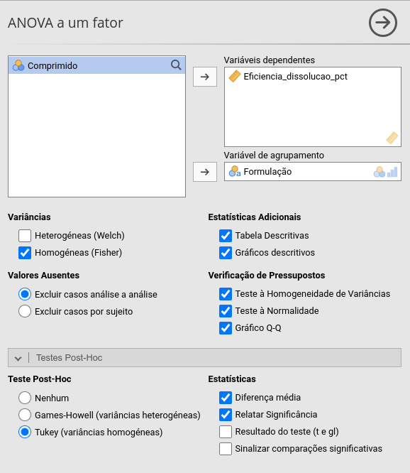
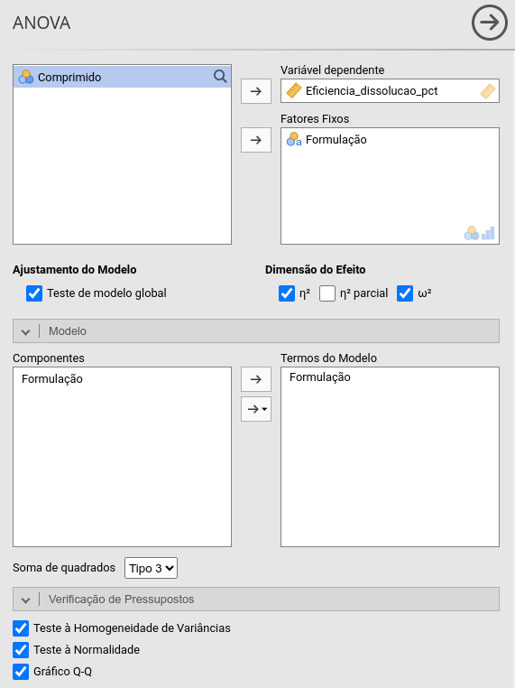
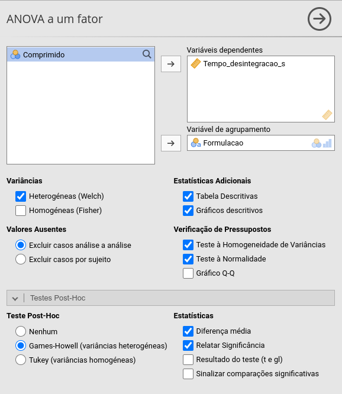
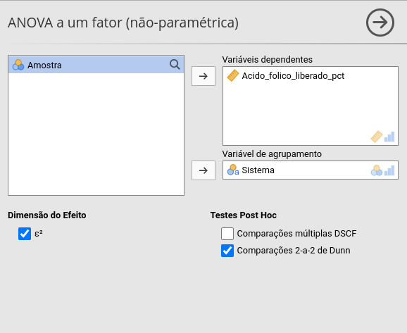
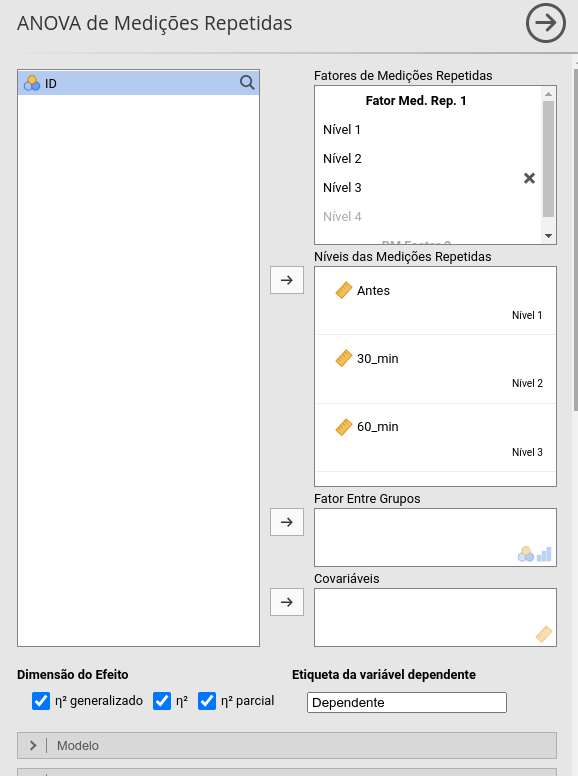
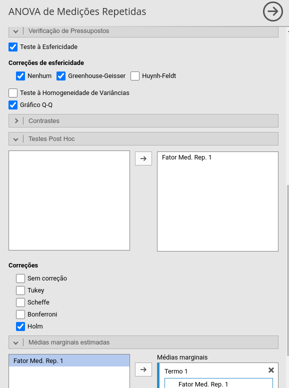

## O que determina o método?

Nesta aula, vamos assumir que o desfecho é **quantitativo**.

A escolha do método depende principalmente da estrutura do estudo:

- **Grupos independentes**
- **Medidas repetidas no mesmo indivíduo**
- **Um ou mais fatores**
- **Pressupostos do modelo**

## O que veremos

#### Mais de dois grupos independentes

::::{.columns}
:::{.column width="20%"}
- ANOVA
- Welch
:::
:::{.column width="80%"}
- Kruskal-Wallis
- Comparações post hoc
:::
::::

#### Mais de duas medidas no mesmo indivíduo

- ANOVA de medidas repetidas
- Friedman

#### Mais de um fator

- ANOVA de duas vias  
- Interação  
- Efeitos simples

# Mais de dois grupos independentes

## ANOVA de uma via

#### Exemplo

Um estudo avaliou a concentração plasmática de um fármaco após a administração de três formulações:

- Formulação A
- Formulação B
- Formulação C

Cada participante recebeu **uma única formulação**.

- **Pergunta:** A concentração plasmática média difere entre as três formulações?

## ANOVA

- Compara a média de um desfecho quantitativo entre três ou mais grupos **independentes**
- Testa se pelo menos a média do desfecho de um grupo difere das demais
- O modelo é válido se há:
  - Distribuição aproximadamente normal dos resíduos (teste de Shapiro-Wilk)
    - Se p-valor > 0,05: ok
    - Se p-valor < 0,05: usar teste de Kruskal-Wallis
  - Homogeneidade das variâncias (teste de Levene)
    - Se p-valor > 0,05: ok (variâncias homogêneas)
    - Se p-valor < 0,05: mudar para ANOVA de Welch

## ANOVA

- A ANOVA é um **teste global**: não identifica quais grupos diferem
  - Se p-valor < 0,05: realize comparações múltiplas (**Tukey HSD**)
  - Se p-valor > 0,05: não há evidência suficiente de diferença entre as médias
- Informe:
  - Média ± desvio padrão de cada grupo
  - Estatística $F$, graus de liberdade e *p*-valor
  - Tamanho do efeito: $\eta^2$ ou $\omega^2$ (conservador)
    - Indica a magnitude da associação entre o fator e a variabilidade do desfecho

## Teste de Tukey HSD (post-hoc)

- O Tukey HSD realiza comparações entre todos os pares de médias

- Para cada comparação, apresenta:
  - **Diferença entre médias**
  - **Intervalo de confiança de 95%**
  - ***p*-valor ajustado**

- Se $p$-valor < 0,05: há diferença entre as médias do par avaliado

## Exemplo 4.1

Em um estudo publicado na Revista Brasileira de Ciências Farmacêuticas, pesquisadores avaliaram comprimidos de ciprofloxacino 250 mg de diferentes produtos comercializados no Brasil e compararam estatisticamente a eficiência de dissolução. Imagine que um laboratório farmacêutico queira comparar quatro formulações de comprimidos de ciprofloxacino 250 mg (Referência, Genérico A, Genérico B e Genérico C). Foram avaliados 10 comprimidos de cada formulação. Para cada comprimido, foi determinada a eficiência de dissolução (%).

- **Pergunta de pesquisa:** a eficiência média de dissolução difere entre as formulações?

- Dados: *exemplo4.1.csv*

##

##

Para obter o tamanho do efeito:

::::{.columns}
:::{.column width="50%"}

:::

:::{.column width="50%"}

:::

::::

## Exemplo 4.1

#### Resultados

A eficiência de dissolução diferiu entre as formulações, $F(3,36)=69{,}7$, $p<0{,}001$, com grande magnitude de efeito ($\omega^2=0{,}837$).

O teste de Tukey HSD mostrou diferença entre:

- Genérico A e Genérico B ($p<0{,}001$);
- Genérico A e Genérico C ($p<0{,}001$);
- Genérico A e Referência ($p=0{,}001$);
- Genérico B e Genérico C ($p<0{,}001$);
- Genérico B e Referência ($p<0{,}001$).

Não foi observada diferença significativa entre o Genérico C e a Referência ($p=0{,}223$).

## ANOVA de Welch

- É uma alternativa à ANOVA tradicional quando há **heterogeneidade das variâncias**
- Não pressupõe que as variâncias dos grupos sejam iguais
- É especialmente útil quando os grupos apresentam **tamanhos amostrais diferentes**
- Assim como a ANOVA tradicional, é um **teste global**
  - Se $p$-valor < 0,05, realize comparações múltiplas (**Games-Howell**)
- Informe:
  - Média ± desvio padrão de cada grupo
  - Estatística de Welch, graus de liberdade e *p*-valor
  - Tamanho do efeito

## Exemplo 4.2

Imagine que um laboratório farmacêutico queira comparar o tempo de desintegração de cinco formulações de comprimidos orodispersíveis:

::::{.columns}
:::{.column width="20%"}
- **D1:** 1% EMCS
- **D2:** 5% EMCS
:::
:::{.column width="20%"}
- **D3:** 1% SSP
- **D4:** 5% SSP
:::
:::{.column width="60%"}
- **D5:** 3% EMCS
:::
::::

Foram avaliados 8 comprimidos de cada formulação. Para cada comprimido, foi determinado o **tempo de desintegração**, em segundos.

- **Pergunta de pesquisa:** o tempo médio de desintegração difere entre as formulações?

- Dados: *exemplo4.2.csv*

##

## Exemplo 4.2

#### Resultados

O tempo de desintegração diferiu entre as formulações, $F(3,18{,}4)=11{,}1$, $p<0{,}001$.

O teste de Games-Howell mostrou diferença entre:

- Formulação A e Formulação B (diferença média = $-3{,}81$ s; $p=0{,}003$);
- Formulação A e Formulação C (diferença média = $-9{,}10$ s; $p=0{,}007$);
- Formulação A e Formulação D (diferença média = $-10{,}33$ s; $p=0{,}039$).

Não foram observadas diferenças significativas entre:

- Formulação B e Formulação C ($p=0{,}130$);
- Formulação B e Formulação D ($p=0{,}241$);
- Formulação C e Formulação D ($p=0{,}987$).

## Teste de Kruskal-Wallis

- Compara a **distribuição de um desfecho quantitativo ou ordinal entre três ou mais grupos independentes**
- Não pressupõe distribuição normal do desfecho
- É um **teste global**
  - Se significativo (em geral, p-valor < 0,05), realize comparações múltiplas (**Dunn**)
  - Ajuste os *p*-valores para múltiplas comparações (**Holm**)
- Informe:
  - Mediana e intervalo interquartil de cada grupo
  - Estatística $H$, graus de liberdade e *p*-valor
  - Tamanho do efeito, quando disponível

## Exemplo 4.3

Imagine que um laboratório farmacêutico queira comparar a quantidade de ácido fólico liberada, após determinado período por três sistemas num ensaio *in vitro*:

- **Ácido fólico cristalino**
- **ZnAl-LDH-ácido fólico**
- **MgAl-LDH-ácido fólico**

Foram realizadas 12 determinações para cada sistema. Para cada amostra, foi determinado o **percentual de ácido fólico liberado**.

- **Pergunta de pesquisa:** a distribuição do percentual de ácido fólico liberado difere entre os sistemas?

- Dados: *exemplo4.3.csv*

##

## Exemplo 4.3

#### Resultados

A distribuição do percentual de ácido fólico liberado diferiu entre os sistemas, $\chi^2(2)=19{,}44$, $p<0{,}001$, com grande magnitude de efeito ($\varepsilon^2=0{,}56$).

As comparações múltiplas pelo teste de Dunn, com ajuste de
Bonferroni, mostraram diferença entre:

- ZnAl-LDH-ácido fólico e MgAl-LDH-ácido fólico
  ($p=0{,}002$);

- ZnAl-LDH-ácido fólico e ácido fólico cristalino
  ($p<0{,}001$).

Não foi observada diferença significativa entre MgAl-LDH-ácido fólico e ácido fólico cristalino ($p=1{,}000$).

# Mais de duas medidas no mesmo indivíduo

## ANOVA de medidas repetidas

#### Exemplo

Um estudo avaliou a concentração plasmática de um fármaco em
três momentos após a administração:

- Antes do tratamento
- 30 minutos
- 60 minutos

Cada participante foi avaliado **nos três momentos**.

- **Pergunta:** A concentração plasmática média difere entre os três momentos?

## ANOVA de medidas repetidas

- Compara a média de um desfecho quantitativo em três ou mais
  **momentos ou condições no mesmo indivíduo**

- Testa se pelo menos a média do desfecho de um momento difere
  das demais

- O modelo é válido se há:

  - Distribuição aproximadamente normal dos resíduos

  - **Esfericidade** das medidas repetidas (teste de **Mauchly**)
    - Se $p$-valor > 0,05: ok
    - Se $p$-valor < 0,05: aplicar correção de **Greenhouse–Geisser**

## ANOVA de medidas repetidas

- A ANOVA é um **teste global**: não identifica quais momentos
  diferem

  - Se $p$-valor < 0,05: realize comparações múltiplas
    **entre os momentos**

  - Se $p$-valor > 0,05: não há evidência suficiente de diferença
    entre as médias

- Informe:

  - Média ± desvio padrão de cada momento

  - Estatística $F$, graus de liberdade e *p*-valor

  - Tamanho do efeito: $\eta^2_p$ (eta quadrado parcial)

## Comparações múltiplas

- Para cada comparação, apresentam:

  - Diferença entre médias
  - Intervalo de confiança de 95%
  - *p*-valor ajustado

- O ajuste controla o aumento do erro decorrente das **múltiplas comparações**

- No jamovi, pode-se utilizar o ajuste de **Holm** (preferencial) ou **Bonferroni**

- Se $p$-valor < 0,05: há diferença entre as médias dos momentos comparados

## Exemplo 4.4

Um estudo avaliou a **concentração plasmática de um fármaco** em 15 participantes após a administração de uma dose oral. A concentração foi medida em três momentos:

- Antes da administração
- 30 minutos após a administração
- 60 minutos após a administração

Cada participante foi avaliado **nos três momentos**.

- **Pergunta:** A concentração plasmática média difere entre os três momentos?

- Dados: *exemplo4.4.csv*

##

::::{.columns}
:::{.column width="33%"}

:::
:::{.column width="33%"}

:::
:::{.column width="33%"}

:::
::::

## Exemplo 4.4

#### Resultados

O teste de Mauchly indicou violação da esfericidade ($W=0{,}14$, $p<0{,}001$). Portanto, foi aplicada a correção de **Greenhouse–Geisser** ($\varepsilon=0{,}54$).

A concentração plasmática diferiu entre os momentos, $F(1{,}08,15{,}08)=4312{,}3$, $p<0{,}001$, com grande magnitude de efeito ($\eta_p^2=0{,}997$).

As comparações múltiplas, com ajuste de Holm, mostraram diferença entre:

- Antes e 30 minutos ($p<0{,}001$);
- Antes e 60 minutos ($p<0{,}001$);
- 30 e 60 minutos ($p<0{,}001$).

## Teste de Friedman

- Compara a **distribuição de um desfecho quantitativo ou ordinal entre três ou mais medidas dependentes**

- Não pressupõe distribuição normal do desfecho

- É um **teste global**

  - Se significativo (em geral, *p*-valor < 0,05), realize comparações múltiplas (**Durbin–Conover**)

- Informe:

  - Mediana e intervalo interquartil de cada momento/condição

  - Estatística $\chi^2$, graus de liberdade e *p*-valor

  - Tamanho do efeito: **$\varepsilon^2$**

## Exemplo 4.5

Um estudo avaliou a **intensidade de náusea** em 15 pacientes durante um tratamento farmacológico. A intensidade dos sintomas foi registrada em uma escala de 0 a 10 em três momentos:

- Antes do tratamento
- 7 dias
- 14 dias

Cada paciente foi avaliado **nos três momentos**.

- **Pergunta:** A distribuição da intensidade da náusea difere entre   os três momentos?

- Dados: *exemplo4.5.csv*

##

## Exemplo 4.5

#### Resultados

A distribuição da intensidade da náusea diferiu entre os momentos, $\chi^2(2)=30{,}0$, $p<0{,}001$.

As comparações múltiplas pelo teste de **Durbin–Conover**, com ajuste de Holm, mostraram diferença entre:

- Antes e 7 dias ($p<0{,}001$);
- Antes e 14 dias ($p<0{,}001$);
- 7 e 14 dias ($p<0{,}001$).

A intensidade da náusea apresentou redução progressiva ao longo do tratamento.

# Fim