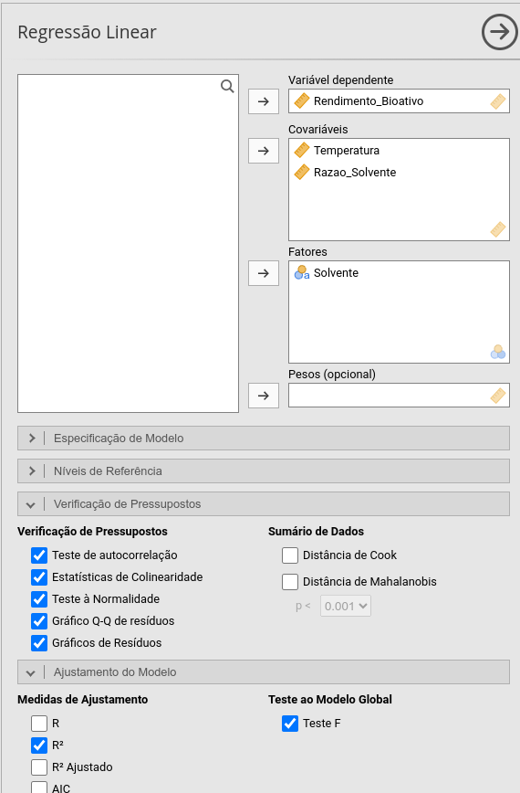
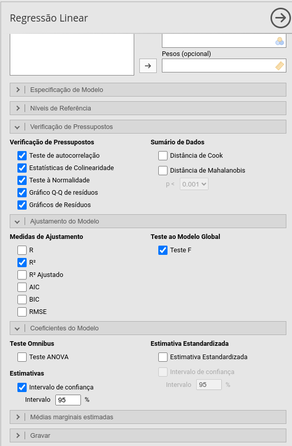
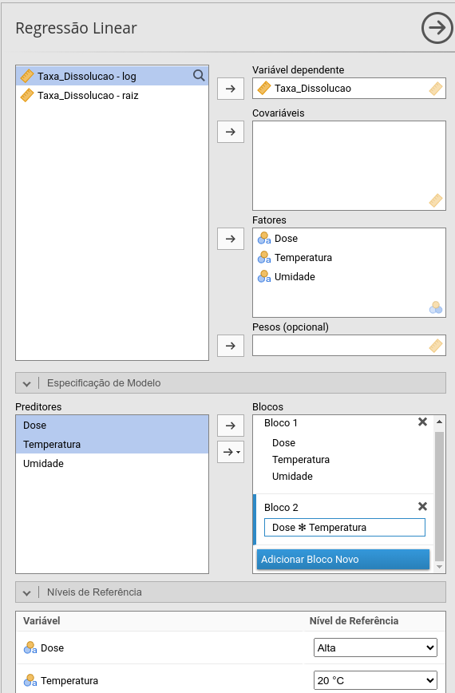
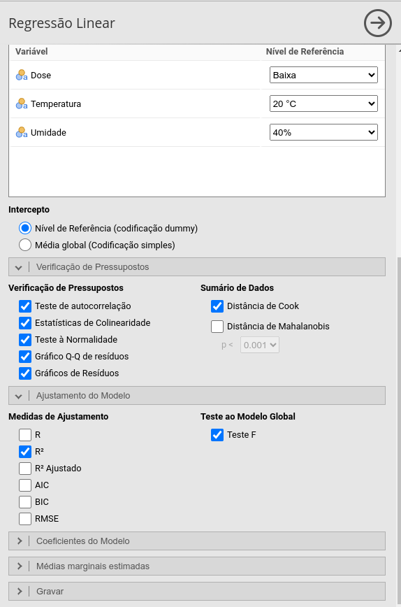
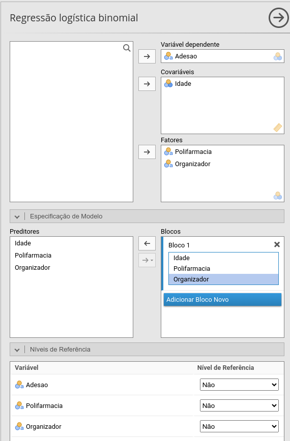
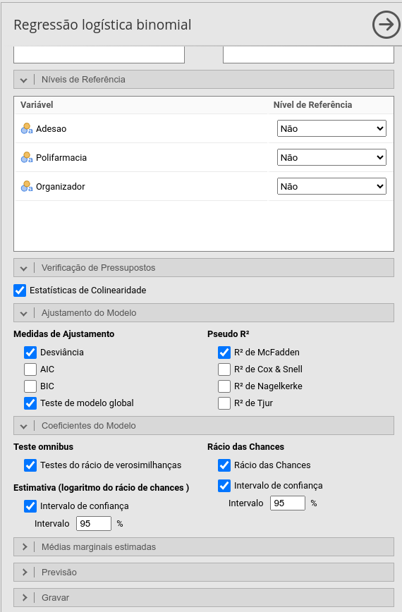

## Modelos de regressão

- Uma modelo de regressão é um método estatístico que modela a relação matemática entre uma variável de interesse e seus potenciais fatores determinantes.
  - **Desfecho (variável resposta):** É o resultado clínico ou farmacológico de interesse que o modelo busca mensurar e prever (ex.: nível glicêmico, cura/óbito ou contagem de reações).
  - **Variável explicativa:** É a intervenção, dose do fármaco ou característica do paciente usada para explicar ou prever a variação no desfecho.

- **Cuidado!** Associação indica apenas dependência estatística entre variáveis.
  - Causalidade exige comprovação de que a intervenção provoca diretamente o desfecho. Isso depdende do seneho do estudo.

## Modelos de regressão

- O tipo de desfecho determina o modelo.
  - Desfecho contínuo → regressão linear;
  - Desfecho binário → regressão logística.

## Regressão linear

- Esse modelo é usado quando o desfecho é numérico contínuo.
- Considere que $y$ é o desfecho e $x_1,x_2,\ldots,x_n$ são as variáveis explicativas.
- O modelo é $$y = \beta_0 + \beta_1 x_1 + \beta_2 x_2 + \cdots + \beta_p x_p + \varepsilon$$
- Exemplo:

(tempo de desintegração) = 2,5 + 0,15 (força de compressão) -- 0,80 (% de desintegrante) + $\varepsilon$

- Cada coeficiente representa a associação entre aquele preditor e o desfecho, mantendo constantes os demais preditores do modelo.
- $\varepsilon$ é o erro aleatório.

## Regressão linear

O modelo pode ser apresentado assim:

| Variável                | Coeficiente (β) | Erro-Padrão (EP)  | IC 95%            | p      |
|:------------------------|----------------:|------------------:|------------------:|-------:|
|Intercepto               | 2,50            | 0,35              | [1,81; 3,19] |  0,008 |
|Força de Compressão (kN) | 0,15            | 0,04              | [0,07; 0,23] |  0,037 |
|Desintegrante (%)        | --0,80          | 0,12              | [--1,04; --0,56] | <0,001 |

Variável resposta: Tempo de desintegração (minutos).

Teste F: $F = 18{,}45$; $gl = 2{,}27$; $p = 0{,}002$.

Ajuste do modelo: $R^2 = 0{,}84$; $p < 0{,}001$.

IC 95%: Intervalo de Confiança de 95%.

## Regressão linear

- **Teste F ($p = 0{,}002$):** Significa que o modelo como um todo é estatisticamente significativo ($p<0{,}05$) para explicar o tempo de desintegração.
- **$R^2 = 0{,}84$:** Indica que 84% da variabilidade no tempo de desintegração é explicada pela força de compressão e porcentagem de desintegrante.

- Para os coeficientes das variáveis explicativas:
  - Quando $p < 0{,}05$, a variável contribui significativamente para o desfecho.
  - Lembre-se: $p$ indica apenas a presença de associação estatística; a magnitude do coeficiente ($\beta$) é o que determina o impacto real na rotina farmacêutica.

## Regressão linear

Interpretação dos coeficientes do exemplo:

- **Força de Compressão ($\beta = 0{,}15$; $p = 0{,}037$):** Apresenta relação direta e estatisticamente significativa ($p < 0{,}05$). Cada 1 kN adicional aumenta o tempo de desintegração em 9 segundos.
- **Desintegrante ($\beta = -0{,}80$; $p < 0{,}001$):** Apresenta relação inversa e estatisticamente significativa. Cada aumento de 1% na proporção de desintegrante reduz o tempo de desintegração em 48 segundos.

## Pressupostos e Diagnósticos

| Pressuposto | Ferramenta | Interpretação | Ação |
| :--- | :--- | :--- | :--- |
| **Normalidade dos Resíduos** | Teste de Shapiro-Wilk  + Gráfico Q-Q | **$p > 0{,}05$:** Resíduos normais. | Se $n > 30$, o modelo é robusto a pequenos desvios. Se houver viés grave, transforme $Y$ ou use MLG. |
| **Homoscedasticidade** | Gráfico *Resíduos vs. Ajustados* (Fitted) | **Gráfico:** Pontos dispersos ao acaso, sem formato de "funil" ou "cone". | Se houver funil (heteroscedasticidade), considere transformação ($log(Y)$) ou erros-padrão robustos. |

## Pressupostos e Diagnósticos

| Pressuposto | Ferramenta | Interpretação | Ação |
| :--- | :--- | :--- | :--- |
| **Linearidade** | Gráfico *Resíduos vs. Ajustados* / Residual Plots | **Gráfico:** Sem padrões parabólicos ou em "U". Linha de tendência horizontal em zero. | Se houver curvatura, adicione termos quadráticos ($X^2$) ou transforme a variável explicativa. |

## Pressupostos e Diagnósticos

| Pressuposto | Ferramenta | Interpretação | Ação |
| :--- | :--- | :--- | :--- |
| **Independência** | Teste de Durbin-Watson | $p > 0{,}05$ indica ausência de autocorrelação. | Importante em dados temporais/seriados. Se violado, considere modelos para dados correlacionados. |
| **Multicolinearidade** | Estatísticas VIF e Tolerance | VIF $< 5$ e Tolerance $> 0{,}2$. | Se VIF $\geq 5$, remova um dos preditores redundantes ou combine-os em um índice. |

## Pressupostos e Diagnósticos

| Pressuposto | Ferramenta | Interpretação | Ação |
| :--- | :--- | :--- | :--- |
| **Pontos Influentes** | Distância de Cook | **Cook $> 1$:** Ponto influente. | Investigar o dado (erro de digitação?). Não remova sem justificativa clínica/metodológica. |

## Exemplo 5.1

Um grupo de pesquisa em Farmácia Verde avaliou a eficiência de extração de flavonoides anti-inflamatórios a partir de resíduos agroindustriais ($N = 60$), comparando um solvente orgânico tradicional com um **Solvente Eutético Profundo Natural (NADES)**.

**Variáveis do Estudo:**

* **Desfecho ($Y$):** Rendimento de Extração ($\text{mg/g}$ de planta) — *Contínua*
* **Preditor 1 ($X_1$):** Temperatura do Processo ($30^\circ\text{C}$ a $70^\circ\text{C}$) — *Contínua*
* **Preditor 2 ($X_2$):** Razão Solvente/Massa ($10$ a $30\text{ mL/g}$) — *Contínua*
* **Preditor 3 ($X_3$):** Tipo de Solvente (*Etanol 70%* vs. *NADES Verde*) — *Categórica*

- Dados: *exemplo5.1.csv*

##

::::{.columns}
:::{.column width="50%"}

:::

:::{.column width="50%"}

:::

::::

## Exercício 5.1

::: {style="font-size: 75%;"}
*Tabela de Coeficientes da Regressão Múltipla ($N = 60$)*

| Variável | $\beta$ | Erro-Padrão | IC 95% | $t$ | $p$ |
| :---------- | ---: | ---: | :---: | ---: | ---: |
| **Intercepto** | 2,88 | 2,50 | [-2,13; 7,90] | 1,15 | 0,254 |
| **Solvente** *(NADES Verde vs. Etanol 70%)* | 11,64 | 0,90 | [9,83; 13,46] | 12,87 | < 0,001 |
| **Temperatura ($^\circ\text{C}$)** | 0,37 | 0,04 | [0,29; 0,45] | 8,89 | < 0,001 |
| **Razão Solvente** *(mL/g)* | 0,88 | 0,07 | [0,75; 1,01] | 13,16 | < 0,001 |

*Variável resposta: Rendimento_Bioativo (mg/g).*  

*Ajuste do Modelo: $R^2 = 0{,}900$; Teste F: $F_{(3, 56)} = 171{,}45$ ($p < 0{,}001$).*

*IC 95%: Intervalo de Confiança de 95%.*
:::

## Exercício 5.1

- O Teste F ($p < 0{,}001$) indica que o conjunto de variáveis explica significativamente o rendimento de extração do bioativo.
- $R^2 = 0{,}900$ significa que 90,0% da variabilidade no rendimento do bioativo é explicada pelas variáveis do modelo.
- Diagnosticando o Modelo:
  - **Normalidade dos Resíduos:** Teste de Shapiro-Wilk ($W = 0{,}98$, $p = 0{,}399$) confirma a distribuição normal dos resíduos.
  - **Multicolinearidade:** Ausente (VIF $< 1{,}05$ e Tolerância $> 0{,}97$ para todas as variáveis).
  - **Autocorrelação:** Teste de Durbin-Watson apresentou $DW = 1{,}42$ ($p = 0{,}030$).

## Exercício 5.1

- Interpretação dos Coeficientes ($\beta$):
  - A referência do modelo é o **Etanol 70%**.
  - **Intercepto ($2{,}88$; $p = 0{,}254$):** Rendimento base estimado ($2{,}88\text{ mg/g}$) quando a temperatura e a razão de solvente são teoricamente nulas (não estatisticamente diferente de zero).
  - **Solvente (+11,64):** Mudar do Etanol 70% para o NADES Verde aumenta o rendimento do bioativo em 11,64 mg/g.
  - **Temperatura (+0,37):** Cada $1^\circ\text{C}$ de aumento na temperatura incrementa o rendimento em 0,37 mg/g.
  - **Razão Solvente (+0,88):** Cada aumento de $1\text{ mL/g}$ na proporção de solvente gera um ganho de 0,88 mg/g no rendimento.

## Exercício 5.2

Um estudo de pré-formulação farmacêutica avaliou o efeito de fatores operacionais na **Taxa de Dissolução (%)** de um comprimido após 30 minutos ($n = 48$).

**Variáveis do Estudo:**

- **Desfecho ($Y$):** Taxa de Dissolução em 30 min (%) -- *Variável Contínua*
- **Preditor 1 ($X_1$):** Dose do Fármaco (*Baixa vs. Alta*)
- **Preditor 2 ($X_2$):** Temperatura do Ensaio (*20 °C vs. 30 °C vs. 40 °C*)
- **Preditor 3 ($X_3$):** Umidade Relativa do Ar (*40% vs. 75%*)

**Perguntas de Pesquisa:** Existe interação significativa entre a *Dose* e a *Temperatura* no perfil de dissolução? Como a *Umidade Relativa* ajusta o efeito principal do processo?

- Dados: *exemplo5.2.csv*

##

::::{.columns}
:::{.column width="50%"}

:::

:::{.column width="50%"}

:::

::::

## Exemplo 5.2

::: {style="font-size: 75%;"}
*Tabela de Coeficientes da Regressão Múltipla com Interação ($N = 48$)*

| Variável | $\beta$ | Erro-Padrão | IC 95% | $t$ | $p$ |
| :---------- | ---: | ---: | :---: | ---: | ---: |
| **Intercepto**  | 50,68 | 0,90 | [48,86; 52,50] | 56,15 | < 0,001 |
| **Dose** *(Alta vs. Baixa)* | 14,07 | 1,18 | [11,69; 16,46] | 11,91 | < 0,001 |
| **Temperatura** *(30 °C vs. 20 °C)* | -7,90 | 1,18 | [-10,29; -5,51] | -6,69 | < 0,001 |
| **Temperatura** *(40 °C vs. 20 °C)* | -21,93 | 1,18 | [-24,31; -19,54] | -18,56 | < 0,001 |
| **Umidade** *(75% vs. 40%)* | -5,18 | 0,68 | [-6,56; -3,80] | -7,59 | < 0,001 |
| **Dose $\times$ Temp** *(Alta vs. Baixa $\times$ 30 °C vs. 20 °C)* | 1,21 | 1,67 | [-2,17; 4,58] | 0,72 | 0,475 |
| **Dose $\times$ Temp** *(Alta vs. Baixa $\times$ 40 °C vs. 20 °C)* | -9,98 | 1,67 | [-13,36; -6,61] | -5,97 | **< 0,001** |

*Variável resposta: Taxa de Dissolução (%).*  

*Ajuste do Modelo: $R^2 = 0{,}973$; Teste F: $F_{(6, 41)} = 248{,}64$ ($p < 0{,}001$).*

*IC 95%: Intervalo de Confiança de 95%.*
:::

## Exemplo 5.2

- O Teste F ($p < 0{,}001$) indica que as variáveis explicam a variação da taxa de dissolução.
- $R^2 = 0{,}973$ significa que 97,3% da variabilidade na taxa de dissolução do comprimido é explicada pelas variáveis incluídas no modelo.
- Interpretação dos Coeficientes ($\beta$):
  - As referências são **dose baixa**, **temperatura de 20ºC**, **Umidade em 40%**.
  - **Umidade (--5,18$):** Deixar o ambiente úmido tira 5,18% da dissolução, agindo de forma independente da dose e da temperatura.
  - **Dose (+14,07):** A 20°C, aumentar a dose para a versão "Alta" aumenta a taxa de dissolução em 14,07% com relação à dose baixa.
  

## Exemplo 5.2

- Interpretação dos Coeficientes ($\beta$):
  - **Interação Dose $\times$ Temp 30 °C ($+1{,}21$; não significativo):** A 30 °C, a Dose Alta se comporta praticamente da mesma forma que a 20°C.
  - **Interação Dose $\times$ Temp 40 °C ($-9{,}98$; significativo):** A 40 °C, o benefício de usar a Dose Alta é atenuado em 9,98% devido ao estresse térmico. O efeito da dose depende de quão quente está o ambiente.
  - **Efeito Principal da Temperatura:** Em relação a 20 °C, a elevação para 30 °C reduz a dissolução em 6,70% ($\beta = -6{,}70$; $p < 0{,}001$), enquanto a elevação para 40 °C gera uma queda de 31,91% ($\beta = -31{,}91$; $p < 0{,}001$).

## Regressão logística

- Usado quando o desfecho ($y$) é **binário** (ex.: Sucesso/Falha, Adesão/Não-adesão, Apresenta Efeito Colateral: Sim/Não).
- Considere que $P$ é a probabilidade do evento de interesse e $x_1, x_2, \ldots, x_p$ são as variáveis explicativas.
- O modelo é representado por:
$$logit(p) = \beta_0 + \beta_1 x_1 + \beta_2 x_2 + \cdots + \beta_p x_p$$
- Exemplo:

logit(Falha na Dissolução) = --2,10 + 0,45 (Idade da Matriz) -- 1,20 (Concentração de Polímero)

- Os coeficientes originais ($\beta$) representam a mudança na razão de chances em escala logarítmica, mas na prática interpretamos a **Razão de Chances** ($OR = e^\beta$).

## Regressão logística

::: {style="font-size: 75%;"}
*Tabela de Estimativas do Modelo — Falha na Dissolução (Sim vs. Não)*

| Preditor | Coeficiente ($\beta$) | Erro-Padrão | Razão de Chances ($OR$) | IC 95% para $OR$ | $p$ |
| :--- | ---: | ---: | ---: | :---: | ---: |
| **Intercepto** | -2,10 | 0,65 | 0,12 | [0,03; 0,44] | 0,001 |
| **Idade da Matriz (meses)** | 0,45 | 0,18 | 1,57 | [1,10; 2,23] | 0,012 |
| **Concentração de Polímero (%)** | -1,20 | 0,32 | 0,30 | [0,16; 0,56] | < 0,001 |

*Variável resposta: Falha na Dissolução (1 = Sim, 0 = Não; Nível de Referência = Não).*

*Teste da Razão de Verossimilhança: $\chi^2 = 28{,}42$; $gl = 2$; $p < 0{,}001$.*

*Ajuste do Modelo: Pseudo $R^2$ de McFadden = $0{,}412$; AIC = $42{,}15$.*
:::

## Regressão logística

- **Teste da Razão de Verossimilhança ($\chi^2 = 28{,}42$; $p < 0{,}001$):** Substitui o Teste F. Indica que o modelo é válido.
- **Pseudo $R^2$ de McFadden ($0{,}412$):** Substitui o $R^2$ tradicional. Valores entre $0{,}20$ e $0{,}40$ indicam um excelente ajuste do modelo aos dados binários.
- Para a Razão de Chances ($OR = e^\beta$):
  - **$OR = 1$:** Ausência de efeito (o preditor não altera as chances do evento).
  - **$OR > 1$:** O preditor aumenta as chances do evento ocorrer (fator de risco/exposição positiva).
  - **$OR < 1$:** O preditor reduz as chances do evento ocorrer (fator de proteção).
  - Se o **IC 95% da $OR$ contiver o valor $1{,}00$**, o preditor não é estatisticamente significativo ($p > 0{,}05$).

## Regressão logística

Interpretação das Razões de Chances do exemplo:

- **Idade da Matriz ($OR = 1{,}57$; $p = 0{,}012$):** Apresenta relação direta e significativa com a falha. Cada mês adicional de armazenamento da matriz polimérica **aumenta as chances de falha na dissolução em 57%** ($OR - 1 = 0{,}57$), mantendo constante a concentração de polímero.
- **Concentração de Polímero ($OR = 0{,}30$; $p < 0{,}001$):** Apresenta relação inversa e significativa. Cada aumento de 1% na concentração de polímero **reduz as chances de falha na dissolução em 70%** ($1 - 0{,}30 = 0{,}70$), funcionando como fator de proteção para a formulação.

## Pressupostos e Diagnósticos

| Pressuposto  | Ferramenta | Interpretação | Ação |
| :--- | :--- | :--- | :--- |
| **Linearidade do Logit** | Teste de Box-Tidwell | **$p > 0{,}05$:** Garante relação linear entre variáveis contínuas e a escala logit. | Se $p < 0{,}05$, faça $X^2$, $\log X$ ou categorize a variável explicativa. |
| **Adequação do Modelo** | Teste de Hosmer-Lemeshow | **$p > 0{,}05$:** Indica bom ajustamente. | Se $p < 0{,}05$, considere adicionar interações ou termos quadráticos. |

## Pressupostos e Diagnósticos

| Pressuposto | Ferramenta | Interpretação | Ação |
| :--- | :--- | :--- | :--- |
| **Capacidade Causal e Descritiva** | Matriz de Confusão e Curva ROC (AUC) | **Matriz:** Avalia Acurácia, Sensibilidade e Especificidade. **AUC $> 0{,}80$:** Excelente capacidade de discriminação. | Se a acurácia for baixa, reavalie os pontos de corte (*cut-off*) de probabilidade ou inclua novos preditores no modelo. |
| **Multicolinearidade** | Estatísticas VIF e Tolerance | **VIF $< 5$** e **Tolerance $> 0{,}2$**. | Se VIF $\ge 5$, remova um dos variáveis redundantes. |

## Pressupostos e Diagnósticos

| Pressuposto | Ferramenta | Interpretação | Ação |
| :--- | :--- | :--- | :--- |
| **Separação Perfeita / Observações Influentes** | Erros-Padrão dos $\beta$ e Distância de Cook / Residuals | **EP extremamente elevado ($\beta > 10$, $\text{EP} > 50$):** Indica separação perfeita ou dados esparsos. **Cook $> 1$:** Ponto influente. | Em caso de separação perfeita, utilize regressão penalizada (Firth) ou reclassifique as categorias do preditor. |

## Exemplo 5.3

Um estudo avaliou os fatores associados à ddesão terapêutica tardia em doentes idosos polimedicados acompanhados na rede pública ($n = 80$).

**Variáveis do Estudo:**

- **Desfecho ($Y$):** Adesão Terapêutica Adequada (*Não vs. Sim*) -- *Variável Dicotômica*
- **Preditor 1 ($X_1$):** Idade do Doente (anos) -- *Variável Contínua*
- **Preditor 2 ($X_2$):** Polifarmácia [$\ge 5$ medicamentos/dia] (*Não vs. Sim*)
- **Preditor 3 ($X_3$):** Uso de Organizador Semanal de Comprimidos (*Não vs. Sim*)

**Perguntas de Pesquisa:** O uso do organizador semanal de comprimidos aumenta significativamente as chances de adesão ao tratamento? Como a polifarmácia e a idade ajustam a probabilidade de adesão do doente?

- Dados: *exemplo5.3.csv*

##

::::{.columns}
:::{.column width="50%"}

:::

:::{.column width="50%"}

:::

::::

## Exemplo 5.3

::: {style="font-size: 70%;"}
*Tabela de Estimativas da Regressão Logística Binária ($N = 80$)*

| Variável | $\beta$ | Erro-Padrão | $OR$ | IC 95% para $OR$ | $Z$ | $p$ |
| :--- | ---: | ---: | ---: | :---: | ---: | ---: |
| **Intercepto** | 5,94 | 2,94 | 381,67 | [1,21; 120656,03] | 2,02 | 0,043 |
| **Idade** *(anos)* | -0,07 | 0,04 | 0,93 | [0,86; 1,01] | -1,72 | 0,086 |
| **Polifarmácia** *(Sim vs. Não)* | -2,68 | 0,69 | 0,07 | [0,02; 0,27] | -3,88 | **< 0,001** |
| **Organizador** *(Sim vs. Não)* | 2,77 | 0,72 | 15,96 | [3,92; 64,96] | 3,87 | **< 0,001** |

*Variável resposta: Adesão Terapêutica (1 = Sim, 0 = Não; Nível de Referência = Não).*  

*Estatísticas de Colinearidade: VIF máximo = 1,29; Tolerância mínima = 0,78 (ausência de multicolinearidade).*

*IC 95%: Intervalo de Confiança de 95% para a Razão de Chances ($OR$).*
:::

## Exemplo 5.3

- **Teste da razão de Verosimilhanças:**
  - **Polifarmácia ($p < 0{,}001$)** e **Organizador ($p < 0{,}001$)** contribuem de forma altamente significativa para a explicação da adesão ao tratamento.
  - **Idade ($p = 0{,}075$)** não alcançou significância estatística ao nível de 5%.
- **Interpretação da Razão de Chances ($OR = e^\beta$):**
  - Os níveis de referência são: **Polifarmácia = Não** e **Organizador = Não**.
  - **$OR > 1$:** Aumenta a chance do desfecho "Adesão = Sim" (fator facilitador/protetor).
  - **$OR < 1$:** Reduz a chance do desfecho "Adesão = Sim" (fator de risco/barreira).

## Exemplo 5.3

- **Interpretação dos Coeficientes e Razões de Chances ($OR$):**
  - **Organizador Semanal ($OR = 15{,}96$; $p < 0{,}001$):** O uso do organizador **aumenta em cerca de 16 vezes** as chances de o paciente aderir ao tratamento ($OR = 15{,}96$; IC 95%: $[3{,}92;\; 64{,}96]$), ajustando para a idade e a polifarmácia.
  - **Polifarmácia ($OR = 0{,}07$; $p < 0{,}001$):** Pacientes em polifarmácia apresentam uma **redução de 93% nas chances de adesão** ($1 - 0{,}07 = 0{,}93$) em comparação com aqueles que não utilizam múltiplos medicamentos ($OR = 0{,}07$; IC 95%: $[0{,}02;\; 0{,}27]$).
  - **Idade ($\beta = -0{,}07$; $OR = 0{,}93$; $p = 0{,}086$):** Não apresentou efeito estatisticamente significativo ($p > 0{,}05$; o IC 95% da $OR$ inclui o valor $1{,}00$).

## Exemplo 5.4

Um estudo avaliou os fatores associados à Ocorrência de Reação Adversa Medicamentosa (RAM) Grave em pacientes internados em unidade de terapia intensiva ($N = 100$).

**Variáveis do Estudo:**

- **Desfecho ($Y$):** Ocorrência de RAM Grave (*Não vs. Sim*) -- *Variável binária*
- **Preditor 1 ($X_1$):** Taxa de Filtração Glomerular Estimada (eTFG, $mL/min/1,73 m²) -- *Variável contínua*
- **Preditor 2 ($X_2$):** Interação Medicamentosa Potencial de Alto Risco (*Não vs. Sim*)
- **Preditor 3 ($X_3$):** Acompanhamento Farmacoterapêutico Intensivo (*Não vs. Sim*)

**Perguntas de Pesquisa:** O acompanhamento farmacoterapêutico intensivo reduz significativamente as chances de desenvolvimento de RAM grave? De que forma a presença de interações medicamentosas e a função renal ($eTFG$) modulam essa probabilidade?

- Dados: *exemplo5.4.csv*

## Exemplo 5.4

::: {style="font-size: 70%;"}
*Tabela de Estimativas da Regressão Logística Binária ($N = 100$)*

| Variável | $\beta$ | Erro-Padrão | $OR$ | $Z$ | $p$ |
| :--- | ---: | ---: | ---: | ---: | ---: |
| **Intercepto** | 4,01 | 1,52 | 55,23 | 2,63 | 0,009 |
| **eTFG** *($\text{mL/min/1,73 m}^2$)* | -0,06 | 0,02 | 0,94 | -2,92 | **0,004** |
| **Interação Medicamentosa** *(Sim vs. Não)* | 2,55 | 0,61 | 12,84 | 4,19 | **< 0,001** |
| **Acompanhamento Farmacêutico** *(Sim vs. Não)* | -2,69 | 0,66 | 0,07 | -4,05 | **< 0,001** |

*Variável resposta: Ocorrência de RAM Grave (1 = Sim, 0 = Não; Nível de Referência = Não).*  

*Ajuste do Modelo: $R^2_{\text{McFadden}} = 0{,}33$; Desviância = $91{,}80$; Teste Global do Modelo: $\chi^2(3) = 46{,}19$ ($p < 0{,}001$).*

*Estatísticas de Colinearidade: VIF máximo = 1,63; Tolerância mínima = 0,61 (ausência de multicolinearidade).*
:::

## Exemplo 5.4

- **Teste da Razão de Verosimilhanças:**
  - **Interação Medicamentosa ($p < 0{,}001$)**, **Acompanhamento Farmacêutico ($p < 0{,}001$)** e **eTFG ($p = 0{,}001$)** contribuem de forma significativa para a explicação da ocorrência de RAM grave.
- **Interpretação da Razão de Chances ($OR = e^\beta$):**
  - Os níveis de referência são: **Interação Medicamentosa = Não** e **Acompanhamento Farmacêutico = Não**.
  - **$OR > 1$:** Aumenta a chance do desfecho "RAM Grave = Sim" (fator de risco).
  - **$OR < 1$:** Reduz a chance do desfecho "RAM Grave = Sim" (fator de proteção).

## Exemplo 5.4

- **Interpretação dos Coeficientes e Razões de Chances ($OR$):**
  - **Acompanhamento Farmacêutico ($OR = 0{,}07$; $p < 0{,}001$):** Pacientes acompanhados pelo farmacêutico clínico apresentam uma **redução de 93% nas chances de RAM grave** ($1 - 0{,}07 = 0{,}93$) em comparação aos não acompanhados.
  - **Interação Medicamentosa ($OR = 12{,}84$; $p < 0{,}001$):** A presença de interações de alto risco **aumenta em cerca de 13 vezes** as chances de ocorrência de RAM grave.
  - **eTFG ($\beta = -0{,}06$; $OR = 0{,}94$; $p = 0{,}004$):** Cada aumento de $1\text{ mL/min/1,73 m}^2$ na $eTFG$ reduz as chances de RAM grave em **6%** ($1 - 0{,}94 = 0{,}06$).

## Exercpicio 5.1

Um estudo ecológico avaliou fatores associados ao consumo de medicamentos nos municípios brasileiros. Cada município foi considerado como unidade de análise. O consumo de medicamentos foi expresso em doses diárias definidas (DDD) por 1.000 habitantes por dia.

**Variáveis do Estudo:**

- **Desfecho ($Y$):** Consumo de medicamentos, expresso em DDD por 1.000 habitantes por dia — *Variável contínua*
- **Variáveis explicativas:** Índice de Desenvolvimento Humano Municipal (IDHM), Renda domiciliar per capita (R$), Percentual da população residente em área urbana (%), Densidade de estabelecimentos privados de saúde por 10.000 habitantes, Percentual da população feminina (%)

**Pergunta de Pesquisa:** Quais uais fatores estão associados ao consumo de medicamentos?

Dados: *exercicio5.1.csv*

## Exercício 5.2

Um estudo transversal avaliou 250 pacientes em acompanhamento ambulatorial com o objetivo de investigar fatores associados à adesão ao tratamento medicamentoso. Foram coletadas informações demográficas, socioeconômicas, clínicas e relacionadas ao tratamento.

**Variáveis do Estudo:**

**Desfecho ($Y$):** Adherence — Não vs. Sim

**Variáveis explicativas:** Gender, Medication_Type, Dosage_mg, Previous_Adherence, Education_Level, Income (renda mensal), Social_Support_Level, Condition_Severity (gravidade da condição clínica), Comorbidities_Count (número de comorbidades), Healthcare_Access, Mental_Health_Status, Insurance_Coverage (cobertura por plano de saúde).

**Pergunta de Pesquisa:** Quais características dos pacientes estão associadas à probabilidade de apresentar adesão ao tratamento medicamentoso?

- Dados: *exercicio5.2.csv*

# Fim